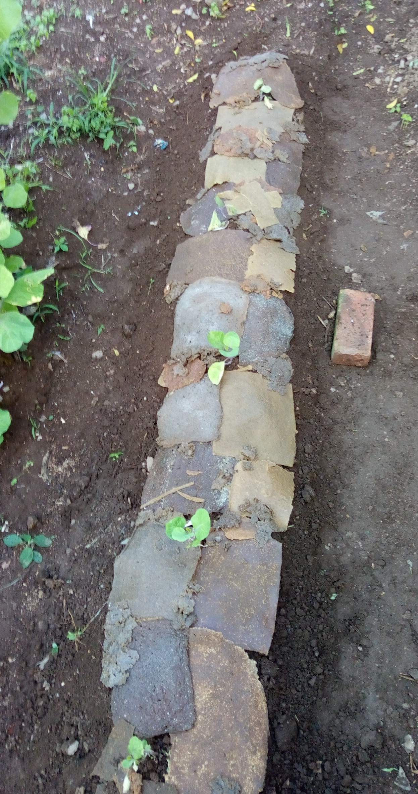
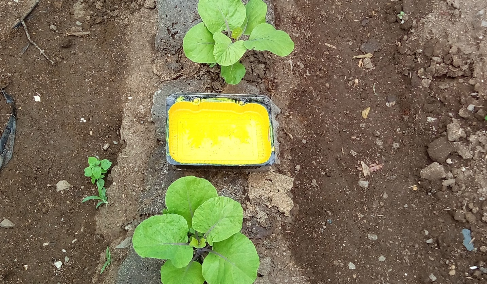

\newpage 
 
**Resumo:** O presente projeto foi desenvolvido com o objetivo de avaliar um novo método de controle de pragas, o _biomulching_. Este método consiste em uma cobertura para solo produzida a base de casca de laranja, com a agregação de extratos de pimenta malagueta, _Capsicum frutensis_, o qual apresenta em sua essência compostos com atividade repelente e inseticida. Por meio de testes foi verificada a eficiência da essência de pimenta e do _biomulching_ contra pragas em couve, _Brassica oleracea_, em comparação com outros tratamentos e mulchings de coberturas de solo, tanto em condições de laboratório como em condições de campo. Os dados obtidos foram analisados seguindo o conceito de programação literal e utilizando pacotes da linguagem R no software Rstudio com o intuito de melhorar a reprodutibilidade da análise. O _biomulching_ obteve um resultado semelhante a outros tipos de mulching quanto a sua função como cobertura de solo, entretanto não é possível afirmar se existem benefícios em relação ao combate de insetos por meio da agregação de essência de pimenta malagueta. Todavia, o projeto contribui para a construção de uma agricultura mais sustentável com menores impactos ao meio ambiente e a saúde humana.

**Palavras-chave:** Agrotóxico. _Biomulching_. Inseticida natural. Cobertura para o solo.


_**Abstract:** The present project was developed with the aim of evaluating a new pest control method, the biomulching. This method consists of a ground cover produced from orange peel, with the addition of extracts of chilli pepper Capsicum frutensis, which has in its essence compounds with repellent and insecticidal activity. Tests were made to verify the efficiency of pepper essence and biomulching against cabbage pests, Brassica oleracea, in comparison with other treatments and mulchings of soil covers, both in laboratory and field conditions. The data obtained were analyzed following the concept of literal programming and using R language packages in the Rstudio software in order to improve the reproducibility of the analysis. The biomulching obtained a similar result to other types of mulching regarding its function as a ground covering, however it is not possible to affirm whether there are benefits in relation to the combat of insects through the aggregation of chili pepper essence. However, the project contributes to the construction of a more sustainable agriculture, reducing impacts on the environment and human health._

_**Keywords:** Pesticide. Biomulching. Natural insecticide. Ground cover._

\newpage

# Introdução

<!--
Com a preocupação cada vez maior por uma alimentação saudável e segura por parte da sociedade, o presente projeto avalia um possível novo método de proteger as plantas, diante do problema do uso indiscriminado de agrotóxicos em plantações, os quais se mal manuseados e aplicados excessivamente podem trazer inúmeros prejuízos à saúde humana e ao meio ambiente.

Dentre os malefícios destes, ao meio ambiente pode-se citar a contaminação do solo, água, ar, diminuição da biodiversidade, pragas resistentes, entre outros, além de tamanhos prejuízos à saúde humana, como intoxicação, câncer e diversas outras doenças causadas pela longa exposição a estas substâncias [@KIM2017525].

Visando diminuir o uso de agrotóxicos e contribuir para uma agricultura mais sustentável e segura, o projeto busca validar a técnica de _biomulching_ com agregação de extratos de _Capsicumm Frutensis_ para o combate de pragas das _Brassicas_, especificamente, pulgões, lagartas e moscas brancas em couves. Esta técnica se baseia na união de outras duas, a de mulching ou cobertura de solo e a de bioinseticida.
 
O uso de lonas para cobertura do solo é uma técnica bastante empregada atualmente, principalmente no cultivo de hortigranjeiros e na produção agroecológica pois seu uso traz benefícios como o controle da umidade e da temperatura do solo e impede o crescimento de plantas daninhas [@chiellini2002environmentally]. As essências de algumas plantas são usadas desde muitos séculos como defensivo agrícola e, atualmente, também como uma alternativa aos agrotóxicos comuns, sendo possível atingir as pragas sem trazer grandes danos às outras espécies presentes na natureza. Em alguns casos, com a mesma eficiência dos agrotóxicos comuns, assim sendo mais seguro para o meio ambiente e a saúde humana, [@saito2004plantas]. 
-->

## Contextualização

O Brasil é um dos maiores produtores agrícolas do mundo e um dos que mais utiliza agrotóxicos. De acordo com [@anvisa2018], 51% dos alimentos contêm resíduos de agrotóxicos, isso sem considerar o glifosato, o pesticida mais utilizado no mundo. Hoje, dos 50 agrotóxicos mais utilizados no país 28 são proibidos em outros países, fora os que são contrabandeados e entram ilegalmente no país, [@agromata2019]. 

Um fato o qual não se pode negar é de que os agrotóxicos afetam a vida como um todo [@hirt2020healthy]. De uma maneira positiva auxiliando no combate de pragas e protegendo as plantações contra perdas econômicas, sendo como uma forma de segurança para os produtores. Contudo, estes também irão afetar todos os outros seres vivos presentes no meio, os quais são benéficos para as plantas, os seres humanos e a natureza como um todo.

Estes agrotóxicos quando má administrados pelos produtores pode causar uma série de malefícios à saúde humana, como intoxicação, desordens hormonais, doenças neurológicas e até mesmo alguns tipos de câncer podem ser favorecidos pela exposição desprotegida e excessiva aos agrotóxicos, [@cassal2014agrotoxicos]. Além de tamanhos prejuízos à saúde, também há vários problemas ambientais que podem ser causados pelo uso indiscriminado destas substâncias. Entre eles estão a poluição do solo, da água e do ar, recursos que consequentemente afetam os ecossistemas e a biodiversidade expostas a tais contaminantes [@soares2007agricultural], [@cassal2014agrotoxicos]. 

Com todos estes problemas ocasionados pelo uso incorreto de pesticidas, evidencia-se uma necessidade por métodos alternativos aos agrotóxicos para promover uma agricultura mais saudável, sustentável e segura. Dentre as alternativas, está a utilização de bioinseticidas, óleos essenciais e extratos que estão presentes nas plantas aromáticas e podem apresentar atividade atraente, repelente e até tóxica a insetos e microrganismos, [@saito2004plantas], [@picancco2010manejo]. Os produtos de plantas são considerados como menos problemáticos para o meio ambiente, devido a fácil decomposição, porém não deixam de ser componentes químicos, devendo seus efeitos serem estudados, [@saito2004plantas]. Entretanto, estes apresentam uma desvantagem em relação aos agrotóxicos convencionais, a necessidade do uso de maiores quantidades de princípio ativo e em maior número de aplicações. 

Uma outra alternativa aos agrotóxicos é a técnica de /mulching/, na qual consiste na cobertura do solo com algum material como folhas secas, jornal, TNT ou com o uso de lonas plásticas, as quais podem ser biodegradáveis ou não. O uso do mulching auxilia em múltiplos fatores durante o cultivo como o controle da umidade do solo, dos nutrientes, da temperatura do solo, de infestações de insetos e como uma barreira para o desenvolvimento de plantas invasoras [@netoavaliaccao], [@chiellini2002environmentally]. Todos os fatores juntos promovem um crescimento das plantas mais rápido, gerando maiores rendimentos e o produto sendo mais facilmente colhido e limpado [@chiellini2002environmentally]. Porém, esta técnica também apresenta suas desvantagens, como normalmente são utilizados mulchings plásticos, estes após um certo período começam e se rasgar e a se degradar em pequenos pedaços que permanecem dispersos no solo, assim perdendo sua utilidade. Este fato faz necessária a remoção do mulching, a qual pode ser difícil de ser realizada se este já estiver bastante degradado e, após a remoção, ainda existirão os resíduos plásticos, os quais não são reciclados devido a presença de altas quantidades de terra e outros contaminantes como pesticidas [@chiellini2002environmentally].

## Motivação

O aluno Mateus Colombo, durante o Ensino Médio, criou o _biomulching_ com agregação de extratos de pimenta malagueta, uma técnica alternativa aos agrotóxicos que consiste como cobertura de solo e de prevenção e controle de pragas em couve. Esta técnica une o princípio da cobertura de solo com o dos bioinseticidas, criando um mulching biodegradável, a base de casca de laranja, com a agregação de extratos de _Capsicum frutensis_ para a liberação controlada de sustâncias inseticidas durante o cultivo. Assim, hipoteticamente, auxiliando as plantas para um melhor desenvolvimento e garantindo uma boa colheita com poucos prejuízos econômicos. A Figura \@ref(fig:biomulch) ilustra o protótipo de Biomulching em plantação de couve.

```{r biomulch, echo=FALSE, fig.align = 'center', out.width= "30%", fig.cap="Protótipo de Biomulching em plantação de couve. Fonte o Autor, Porto Alegre - RS, 2021."}



```

<!-- Aqui vem um parágrafo onde são apresentadas resumidamente as conclusões obtidas do processo de análise daquele trabalho e onde tais conclusões foram apresentadas. --> 

Na parte de análise, no projeto original, uma grande quantidade de dados sobre diversas variáveis e testes foram obtidas e processadas muitas vezes manualmente. //

<!-- A análise precedente havia sido feito através de tabelas preenchidas manualmente no software Microsoft Excel e cuja análise estatística havia sido feita da própria ferramenta.... (como inseriu os dados, como foi feita as equações estatística para cálculos, como os gráficos foram gerados, etc). -->

A análise manual dos dados via Excel poderia gerar conclusões imprecisas e indefinidas sobre o objeto de estudo. Este é um problema conhecido .... 

<!-- Autocrítica, em geral tal abordagem de análise via Microsoft Excel e ferramentas similares leva a inúmeros problemas conhecidos na comunidade científica. Alguns exemplos podem ser o caso do nomes do genes em

Retirar exemplos de problemas com excel deste artigo
https://theconversation.com/excel-autocorrect-errors-still-plague-genetic-research-raising-concerns-over-scientific-rigour-166554

Bio

Problema dos nomes dos genes baseadas em suposições erradas do Excel
- https://bmcbioinformatics.biomedcentral.com/articles/10.1186/1471-2105-5-80 
- https://journals.plos.org/ploscompbiol/article?id=10.1371/journal.pcbi.1008984

Políticas públicas

Problema de políticas públicas baseadas em análise com erro Excel
- "Dívida pública limita o crescimento econômico" Reinhart and Rogoff (http://www.nber.org/papers/w15639)
- Thomas Herndon and professors Michael Ash and Robert Pollin
  - http://www.peri.umass.edu/fileadmin/pdf/working_papers/working_papers_301-350/WP322.pdf
  - A correlação não se verifica...

Saúde

Problemas de perda de dados com tabelas Excel (COVID-19)
- https://www.bbc.com/news/technology-54423988

In biomedical research, a mistake in preparing a sample sheet resulted in a whole set of sample labels being shifted by one position and completely changing the genomic analysis results. 
https://www.nature.com/articles/nm0610-618a

--> 

## Proposta deste trabalho

Visando mitigar os problemas acima citados, o presente projeto se propõem a reavaliar as conclusões que haviam sido delineadas precedentemente utilizando ferramentas modernas de análise de dados que se propõem a serem reprodutíveis.

Através da análise correta dos dados obtidos dos experimentos, o trabalho de pesquisa ganha maior reprodutibilidade e confiança ao estudo que foi realizado. Uma proposta de amenizar os problemas causados na análise de dados por erros humanos é a utilização de softwares e outros programas de análise tais como o Rstudio.

Para a parte de organização e descrição dos processos do projeto, uma técnica que pode ser empregada é a de _literal programing_, a qual foi criada por Donald Knuth e é semelhante a um caderno de anotações digital. Com a programação literal as informações sobre os conceitos, as ideias, os precedimentos, os resultados e como todos estes foram processados no programa, ficam descritos em um único lugar. Assim tanto a parte da pesquisa propriamente dita, quanto da análise, são escritas de uma forma explicativa, intercalando o sprit com trechos de códigos, que executam funções com os dados, com textos da linguagem humana, que explicam o foi feito e como foi feito. Assim tornando o script mais fácil de entender, tanto às pessoas que possuem maior conhecimento sobre pragramação quanto às que não dominam muito essa área [@knuth1984literate]. 

Para a avalidação da técnica de _biomulching_ serão empregadas ferramentas computacionais durante o processo de pesquisa, pois estas reduzem os possíveis erros da manipulação de dados e contribuem com a reprodutibilidade da metodologia empregada, assim aumentando a confiança nos resultados e conclusões obtidas através dos experimentos. Ademais, outra técnica a qual pode auxiliar durante o uso de tais ferramentas é a de _literal programming_, onde descrevemos o que está sendo feito juntamente com os código e algoritmos que executam funções com os dados [@knuth1984literate]. Isso permite um maior detalhamento da metodologia e controle das variáveis, o que também contribui para aumentar o nível de confiança numa pesquisa.

# Objetivos

## Objetivo geral

O objetivo do projeto é utilizar ferramentas computacinais como o Rstudio para verificar se conseguimos responder os questionamentos a respeito do biomulching de forma reprodutível, ou seja, independente do equipamento utilizado e do analista que performa a análise.

## Objetivos específicos

 - Utilizar os dados do projeto de desenvolimento do _biomulching_ para realizar a análise por meio de pacotes da linguagem de programação R com RStudio.
 
 - Empregar o conceito de programação literal durante o desenvolvimento do projeto
 
 - Discutir os resultados obtidos por meio do RStudio comparando-os com os resultados do projeto original do _biomulching_ para verificar se há diferenças no processo de análise que contribuam com a reprodutibilidade.
 
 - Avaliar se o biomulching pode ser utilizado como cobertura de solo e se auxilia no combate pragas na cultura da couve.

# Métodos e materiais

Primeiramente foram reorganizados os dados do projeto original para facilitar a sua manipulação através do software. Os dados brutos foram obtidos através de experimentos em condições de laboratório e em condições de campo. No laboratório foi testado se a essência de pimenta possui a capacidade de combater pulgões e como seria o comportamento do _biomulching_ com a essencia de pimenta. No teste em campo foi verificado o comportamento do _biomulching_ como cobertura de solo e agente inibidor de pragas por meio de análise de diversas variáveis. Posteriormente os dados foram inseridos no Rstudio e então analisádos utilizando diferentes pacotes da linguagem R e o conceito de _literal programing_. Na parte dos resultados foram produzidos gráficos e análises estatísticas conforme os questionamentos do projeto original e também foi estudada a possibilidade de realizar novos questionamentos a partir dos dados. 

A seguir são detalhadas as metodologias de como os dados foram obtidos e processados.

Segue o fluxograma com todas as etapas de desenvolvimento do projeto de pesquisa, Figura \@ref(fig:fluxograma):


```{r fluxograma, echo=FALSE, fig.align = 'center', fig.cap= "Fluxograma da metodologia. Fonte o Autor, Porto Alegre - RS, 2021."}

knitr::include_graphics("Slide2.JPG")

```


## Teste em condições controladas da essência e do _biomulching_

O seguinte teste foi baseado na metodologia de [@santos2015extratos].

Material utilizado:
 
- 5 vidros
- Plástico filme
- 5 pedaços de papel toalha
- Repelente a base de icaridina
- Essência de pimenta na concentração de 5000 ppm
- Água

A proposta é a comparação entre a ação de um bioinseticida comercial, o extrato da pimenta, _biomulching_ e a contraprova. Para assim verificar os efeitos e a eficiência do novo método.
Foram colocadas em cada vidro um papel toalha no fundo, juntamente com folhas de couve frescas sem pulgões. Após, os pulgões foram coletados de couves e passados aproximadamente 150 pulgões para cada vidro. Então os vidros foram distribuídos da seguinte forma:

- 1 bioinseticida comercial (adição 10 ml, sendo 5ml repelente a base de icaridina e 5ml de água)
- 1 extrato de pimenta (adição de 10ml da essência na concentração de 5000ppm)
- 1 _biomulching_ (adição de 10ml de água)
- 2 contraprova (adição de somente 10 ml de água)

Manteve-se a temperatura em torno de 25°C, com observações nos intervalos de 30min, 1h, 2h, 12h, 24h, 48h e 116h, após o início do teste.

## Teste do _biomulching_ em plantação de couve

Primeiramente o solo foi preparado com um mês de antecedência do início do teste, sendo feita a retirada de plantas invasoras, a aeração e aração do solo, com cerca de 20cm de profundidade. Após o solo foi adubado com cinzas, restos de alimentos, cal e esterco. Foram dispostos cinco canteiros de aproximadamente 0,5m X 2,5m, totalizando cerca de 15m², nos quais foram plantados cinco pés de couve (_Brassica oleracea_) no espaçamento de 50cm X 1m em cada canteiro. Foram plantadas 25 mudas de couve, as quais haviam sido cultivadas a partir de ramos de outras plantas. A Figura \@ref(fig:plantacao) mostra como estavam dispostos os canteiros do experimento.


```{r plantacao, echo=FALSE, fig.align = 'center', out.width= "90%", fig.cap= "Plantação teste. Fonte o Autor, Porto Alegre - RS, 2021."}

knitr::include_graphics("P_20190209_185515.jpg")

```

Legenda:

G = Canteiro com _biomulching_

T = Canteiro de contraprova

P = Canteiro com aplicação de essência de pimenta

S = Canteiro com lona plástica amarela

X = Canteiro com lona plástica preta

Para a cobertura do canteiro com o _biomulching_, foram utilizados pedaços pequenos do protótipo de _biomulching_ totalizando a área de 1m². Depois de produzidos os protótipos foram armazenados em sacos plásticos até o momento de aplicação na plantação quando então foram dispostos sobre o solo um ao lado do outro entre as couves, formando a área de cobertura de 1m². Também foram dispostas as coberturas de mulching amarelo e preto sobre os canteiros S e X, respectivamente.
O controle deste teste foi realizado do dia 17 de dezembro de 2018 até o dia 11 de março de 2019, totalizando o período de 84 dias.

O controle do experimento foi baseado no trabalho de [@netoavaliaccao] sendo feitas algumas alterações conforme a disponibilidade dos equipamentos presentes no laboratório e a praticidade durante o experimento em campo.

Para o experimento foram analisadas as seguintes variáveis conforme descritas:

- Temperatura: 

Controle por meio dos dados da estação meteorológica de Garibaldi (estação do aeroclube). As medições foram realizadas sempre as 14:00 horas de cada dia. 

- Umidade relativa do ar: 

Controle por meio dos dados da estação meteorológica de Garibaldi (estação do aeroclube). As medições foram realizadas sempre as 14:00 horas de cada dia. 

- Umidade do solo: 

Controle a cada três dias por amostra do solo coletada a 10cm de profundidade e analisada pelo método da frigideira conforme: **https://www.youtube.com/watch?v=2OmsbVF9O88**, [@santos2018].

No método da frigideira a terra é peneirada, depois pesada e então colocada na frigideira e aquecida até estar seca, cerda de 10 minutos em fogo alto. Depois deixa-se esfriar e então pesa-se a amostra de terra seca e calcula-se a diferença de massa para obter o percentual de umidade do solo.
Pelo fato de o método da frigideira ser pouco confiável, utilizou-se uma formula para correção do percentual de umidade obtido. Para tal finalidade utilizou-se a seguinte fórmula:

(percentual obtido x 0,9778) – 2,6095 = percentual corrigido.

- pH do solo: 

Por meio de amostra do solo analisado em laboratório com uso da fita de pH.

- Número de plantas invasoras:

 Controle semanal com a contagem das plantas invasoras e demarcação através de mapeamento.

- Massa foliar:

Aferição da massa total (caule e folhas) e massa consmetível (folhas saudáveis) das plantas após a colheita. 

- Porte das plantas:

Medição de altura nas semanas, 9, 11 e 12, além disso foi aferido o tamanho máximo médio das folhas ao final experimento.

- Degradação do _biomulching_: 

Medição semanal da área com presença do _biomulching_.

- Quantidade de pulgões alados , outros insetos e inimigos naturais:

Para o monitoramento da população de pulgões alados e outros insetos foi utilizado o método de armadilha com bandejas de água desenvolvida por Moerick, [@resende2007amostragem], Figura \@ref(fig:bandeja). As bandejas foram pintadas de amarelo, para atrair os insetos foi usado o estímulo visual da radiação amarela refletiva.


```{r bandeja, echo=FALSE, fig.align = 'center', out.width= "50%", fig.cap="Armadilha utilizada no controle do número de pulgões alados. Fonte o Autor, Porto Alegre - RS, 2021."}




```


As armadilhas foram confeccionadas usando bandejas plásticas com 1 litro de capacidade, pintadas internamente de amarelo. Em cada bandeja foi colocado 500 ml de água e 2 gotas de detergente, para quebrar a tensão superficial, foram cobertos por uma proteção de organza para evitar perda de material em caso de transbordamento e foram instaladas na altura do dossel das plantas. O controle foi feito a cada 3 dias sendo utilizadas duas armadilhas por canteiro.

\newpage

## Pré tratamento dos dados do projeto do _biomulching_

Nesta etapa os dados coletados do projeto de desenvolvimento do _biomulching_, os quais estavam em tabelas no formato xlsx, foram organizados com o objetivo de facilidar a leitura das tabela pelo programa Rstudio. Para tanto, criaram-se novas tabelas organizando os dados em colunas continuas com cada célula corespondendo a uma unica observação. Removeram-se informações referentes a plotagem de gráficos e outras não pertinentes aos dados brutos. Mantiveram-se a separação dos dados entre as pastas já existentes no arquivo.


## Importação e organização dos dados no Rstudio

Para transferir os dados para o Rstudio utilizou-se o comando "read_xlsx" do pacote tidyverse, por meio do qual foram lidas as tabelas em xlsx onde estavam os dados. Para cada conjunto de dados referentes as diferentes variáveis e testes foi criado uma referencia começando por "df." seguido do nome para identificar o conjunto de dados. Alguns conjuntos ainda foram reformatados para uma melhor organização e também para adicionar o código/legenda referente aos tratamentos utilizados no projeto.

 Foram utilizados os seguintes pacotes de linguagem R para a importação e organização dos dados: 

 Bibliotecas: tidyverse, readxl, lubridate, ggplot2 e plotly.

```{r pacotes, include=FALSE}
#carrega os pacotes necessários.
library(tidyverse)
library(readxl)
library(lubridate)
library(knitr)
library(kableExtra)

#cria legenda dos tratamentos para o teste em plantação de couve.
tribble (
  ~Código, ~Prevenção,
  "G", "Biomulching",
  "T", "Contraprova",
  "P", "Pimenta",
  "S", "Lona Amarela",
  "X", "Lona Preta") -> df.legenda

```

### Dados do experimento em condições controladas

Foram importados os seguintes conjuntos dados os quais foram armazenados em "df.controlado":

 - Quantidade de pulgões vivos ao longo do tempo.
 
 - Quantidade de pulgões mortos ao longo do tempo.

Legenda:

- C = Controle 1
- C+ = Controle 2
- B = _biomulching_
- I = Icaridina
- E = Essência de pimenta

Inicialmente foi criado uma legenda com o intuito de melhorar a interpretação dos dados ao gerar os gráficos. Depois os dados foram reorganizados de forma que os diferentes tratamentos fossem reunidos em uma única coluna.

```{r controlado, include=FALSE}
data.filename <- "dados.xlsx"

tribble (~Código, ~Tratamento,
         "C", "Contraprova #1",
         "C+", "Contraprova #2",
         "B", "Biomulching",
         "I", "Icaridina",
         "E", "Essência de Pimenta") -> df.controlado.legenda

bind_rows(
  read_xlsx(data.filename,
            sheet = "controlado", 
            range = "A2:F11") %>%
    mutate(Estado = "vivos") %>%
    pivot_longer(cols = C:E,
               names_to="Tratamento",
               values_to="Quantidade"),
  
  read_xlsx(data.filename,
            sheet = "controlado", 
            range = "I2:N11") %>%
    mutate(Estado = "mortos") %>%
    pivot_longer(cols = C:E,
               names_to="Tratamento",
               values_to="Quantidade")) %>%
  rename(Código = Tratamento) %>%
  left_join(df.controlado.legenda, by="Código") -> df.controlado

```

### Presença de insetos na plantação de couve
 
 Foram importados os seguintes conjuntos dados, os quais foram armazenados em "df.armadilhas":
 
 - Quantidade de pulgões capturados nas armadilhas.

 - Quantidade de outros insetos capturados nas armadilhas.

 - Quantidade de inimigos naturais capturados nas armadilhas.

 - Presença de outros agentes prejudiciais:
 Os dados correspondem a contagem de moscas e lagartas encotrados nas couves durante o periodo de 30 dias, um mês. A data de inicio da contagem foi o dia de inicio do experimento, a primeira contagem sendo realizada no 30º dia 16/01/2019), a segunda no 60º dia (15/02/2019) e o ultio no 83º dia (10/03/2019). Os dados obtidos eram sempre atualizados ao final dos 30 dias pois o número desses insetos era pequeno.
 
  
Para a realização desta etapa primeiramente foram criadas as variáveis de semana e dia para adicionar aos dados das armadilhas. Também foi criada uma referência para os dias nos quais ocorreu a atualização da contagem de outros agentes perjudiciais. Os dados correspondentes às moscas e lagartas foram inseridos agregaram-se os valores de dia e mês, retirou-se a coluna do mês e adicionou-se a legenda para os códigos de cada prevenção. Posteriormente foram inseridos os dados obtidos por meio das armadilhas, onde estavam os valores de pulgões, outros insetos e inimigos naturais. Juntaram-se todos os dados em um unico conjunto de dados e modificou-se a organização das colunas das prevenções para ocuparem apenas uma coluna. Removeram-se as referências sem valores e a coluna das semanas. Então foi adicionada a legenda para os diferentes códigos das prevenções e finalmente adicionou-se os valores de moscas e lagartas para formar apenas um conjunto de dados com todos os agentes.
 
```{r pragas, include=FALSE}

read_xlsx(data.filename,
          sheet="armadilhas", 
          range="A3:A26") -> df.semana

read_xlsx(data.filename,
          sheet="armadilhas", 
          range = "Q3:Q26") -> df.dia

tribble (~mês, ~Dia,
         "1", "2019-01-16",
         "2", "2019-02-15",
         "3", "2019-03-11",) -> df.dia.mês


read_xlsx(data.filename,
          sheet = "plantas", 
          range = "A2:D17") %>%
  rename(Prevenção = `Canteiro`)%>%
  pivot_longer(cols = mosca:lagarta,
               names_to="Agente",
               values_to="Quantidade")%>%
  mutate(mês = as.character(mês))%>%
  left_join(df.dia.mês, by= "mês")%>%
  mutate(Dia = as_datetime(Dia))%>%
  select(-mês)%>%
  rename(Código = Prevenção)%>%
  left_join(df.legenda, by="Código")-> df.prejudiciais

bind_rows( 
    read_xlsx(data.filename,
              sheet = "armadilhas", 
              range = "B3:F26") %>% 
     mutate(Agente = "Pulgões") %>%
     bind_cols(df.semana, df.dia),
             
    read_xlsx(data.filename,
              sheet = "armadilhas", 
              range = "G3:K26") %>%
      mutate(Agente = "Outros") %>%
      bind_cols(df.semana, df.dia),
    
    read_xlsx(data.filename,
              sheet = "armadilhas", 
              range = "L3:P26") %>%
      mutate(Agente = "Naturais") %>%
      bind_cols(df.semana, df.dia)) %>%
  
  pivot_longer(cols = T:X,
               names_to="Prevenção",
               values_to="Quantidade") %>%
  filter(!is.na(Quantidade)) %>%
  select(-`semana`)%>%
  rename(Código = Prevenção) %>%
  left_join (df.legenda, by="Código")%>%
  bind_rows(df.prejudiciais)-> df.armadilhas

```

### Dados a respeito das condições climáticas ao longo do período experimental
 
 Foram importados os seguintes conjuntos dados os quais foram armazenados em "df.clima":
 
 - Temperatura ao longo do período experimental.

 - Umidade relativa do ar ao longo do período experimental.

 - Umidade do solo ao longo do período experimental:
 Para os valores de umidade do solo foi criado um diretório a parte, onde forma realizados cálculos a partir dos valores originais para crear os valores corrigidos do percentual de umidade do solo. Os valores foram armazenados em "df.umidade_solo".
 
 O cálculo do percentual corrigido da umidade do solo foi realizado através da seguinte equação:
 
 Diferença = (massa umida) - (massa seca)
 Água/100g = (Diferença * 100)/(massa umida)
 Percentual corrigido = (((água/100g)*0.9778)-2.6095)*0,01


```{r clima, include=FALSE}

read_xlsx(data.filename,
          sheet = "umidade", 
          range = "I2:J87") %>%
  rename(umidade = `unidade`)%>%
  bind_cols(
    read_xlsx(data.filename,
          sheet = "temperatura", 
          range = "B2:B87")) -> df.clima

read_xlsx(data.filename,
          sheet = "umidade", 
          range = "A2:D108")%>%
  mutate(`diferença (g)` = `massa umida (g)` - `massa final (g)`)%>%
  mutate(`água/100g` = (`diferença (g)`*100)/`massa umida (g)`)%>%
  mutate(`percentual corrigido` = ((`água/100g`*0.9778)-2.6095)*0.01)%>%
  mutate(`percentual corrigido` = as.numeric(`percentual corrigido`))%>%
  rename(Código = Prevenção) %>%
  left_join (df.legenda, by="Código")-> df.umidade_solo

```

### Quantidade de plantas invasoras ao longo do período experimental
 
 Foram importados os seguintes conjuntos dados os quais foram armazenados em "df.plantas_invasoras":
 
 - Número de plantas invasoras presentes em cada canteiros ao longo do período experimental:
 Foi criada uma tibble para adicionar os dias em que foram realizadas as medições a cada semana. Adicionou-se a legenda dos diferentes tratamentos e removeu-se a coluna da semana.
 
```{r invasoras, include=FALSE}
tibble (semana = 1:11) %>%
  mutate(Dia = ymd("2018-12-27") + days((semana -1) * 7)) %>%
  bind_rows(tibble (semana = max(.$semana) + 1,
                    Dia = max(.$Dia) + days(4))) -> df.dia.semana

read_xlsx(data.filename,
          sheet = "degradação", 
          range = "K2:N62")%>%
  select(-`presença invasoras`)%>%
  left_join(df.dia.semana, by= "semana")%>%
  select(-`semana`)%>%
  rename(Quantidade = quantidade)%>%
  mutate(Dia = as_datetime(Dia))%>%
  rename(Código = Prevenção) %>%
  left_join (df.legenda, by="Código")-> df.plantas_invasoras

```

### Dados das plantas de couve

Foram importados os seguintes conjuntos dados os quais foram armazenados em "df.dados_plantas":

 - Altura das couves:
 Corresponde aos valores obtidos em três medições da altura de cada couve nos diferentes tratamentos. Inicialmente estes valores foram lidos separados do restante e após alguns ajustes na organização das colunas e nomenclatura, estes foram adicionados em um grupo junto com os valores das outras variáveis. A referência "altura" foi substituido por "valor"
 
 - Massa folhar total das couves ao final do periodo experimental: 
 A referência "massa total (g)" foi substituido por "valor" para facilitar na união dos dados em um único conjunto.
 
 - Massa folhar comestível das couves ao final do periodo experimental:
 A referência "massa comestivel (g)" foi substituido por "valor" para facilitar na união dos dados em um único conjunto.
 
 - Tamanho médio máximo das folhas de couve:
 Corresponde ao valor médio máxima das folhas de cada couve em cada um dos diferentes tratamentos ao final do período experimental. A referência "tamanho" foi substituido por "valor" para facilitar na união dos dados em um único conjunto.

```{r plantas, include=FALSE}

read_xlsx(data.filename,
          sheet = "degradação",
          range = "E2:H74")%>%
  rename(Valor = altura)%>%
  rename(Dia = dia)%>%
  mutate(Observação = "altura")%>%
  rename(Código = Prevenção) %>%
  left_join (df.legenda, by="Código")-> df.altura


bind_rows( 
  read_xlsx(data.filename,
            sheet = "solo", 
            range = "E2:G26") %>%
    mutate(Observação = "massa total (g)"),
             
  read_xlsx(data.filename,
            sheet = "solo",
            range = "I2:K26") %>%
    mutate(Observação = "massa comestível (g)"),
  
  read_xlsx(data.filename,
            sheet = "solo", 
            range = "A2:C26") %>%
    mutate(Observação = "tamanho (cm)")%>%
  rename(`massa (g)` = `tamanho`))%>%
  rename(`Valor` = `massa (g)`)%>%
  mutate(`Dia` = ymd_hms("2019-03-11 00:00:00"))%>%
  rename(Código = Canteiro) %>%
  left_join (df.legenda, by="Código")%>%
  bind_rows(df.altura)-> df.dados_plantas

```

### Degradação do protótipo de _biomulching_
 
Foram importados os seguintes conjuntos dados os quais foram armazenados em "df.degradação":

 - Percentual da área degradada a cada semana durante o período experimental:
 Foram alterados os valores de "Percentual de degração" para valor em "Porcentagem de degradação" dividindo o valor original por 100. Após foram retiradas as colunas "semana" e "Percentual de degradação" para uma melhor comparação com os demais dados.

```{r degradação, include=FALSE}
read_xlsx(data.filename,
          sheet = "degradação", 
          range = "A2:C14")%>%
  mutate(`Porcentagem de degradação` = `Percentual de degradação`/100)%>%
  select(-"semana",-"Percentual de degradação")%>%
  rename(Dia = dia)-> df.degradaçao

```

# Resultados

## Teste em condições controladas

Após realizado o teste obtiveram-se os resultados do número de pulgões vivos e mortos em cada tratamento. Notou-se que a essência de pimenta conseguiu atingir um resultado satisfatório, visto que matou todos os pulgões em cerca de duas horas na concentração de 5000ppm. Já o tratamento à base de icaridina também conseguiu eliminar totalmente a população de pulgões, contudo, foi observado que após a aplicação do repelente a base de icaridina, a folha de couve teve alterações em sua coloração e em características físicas, ficando com uma coloração amarelada e murcha.
Também se verificou que nas amostras de controle e do tratamento com o _biomulching_ ocorreu uma proliferação de pulgões após 48horas, aumentando o número total de pulgões vivos nas amostras conforme evidencia a figura abaixo, Figura \@ref(fig:dado):

```{r dado, echo=FALSE, fig.align = 'center', out.width= "90%", fig.cap="Fonte o autor, Porto Alegre - RS, 2021"}

df.controlado %>%
  pivot_wider(names_from="Estado", values_from="Quantidade") %>%
  mutate(populacao = vivos+mortos) %>%
  group_by(Tratamento) %>%
  mutate(crescimento = populacao - min(populacao)) %>%
  ggplot(aes(x=`Tempo (h)`, y = vivos, color=Tratamento))+
  geom_line() +
  geom_point() +
  scale_y_continuous(breaks = seq(0, 200, by = 20)) +
  ggtitle("Crescimento da pupulção de pulgões em cada tratamento ao longo do tempo") +
  ylab("Número de pulgões vivos") +
  scale_x_continuous(breaks = seq(0, 200, by = 12))

```

Quanto ao tratamento com o _biomulching_, este não teve resultado semelhante quando comparados aos tratamentos com a essência de pimenta e icaridina. O que pode se relacionar ao fato de o _biomulching_ não ter se degradado completamente, ou a outros fatores ainda desconhecidos. Contudo mostra certa redução do número de pulgões quando comparado com as amostras de controle.

Também se verificou a eficiência de cada método através da fórmula de Abbott, sendo os resultados apresentados na tabela abaixo, Tabela \@ref(tab:tab1):

Fórmula de Abbott:

Eficiência (%) = ((T-Tr)/T)x100

onde:

T = média dos valores de contraprova

Tr = tratamento

```{r tab1, echo=FALSE}
df.controlado %>%
  filter(`Tempo (h)` == "116") %>%
  filter(Estado %in% c("vivos")) %>%
  filter(grepl("Contraprova", Tratamento)) %>%
  pull(Quantidade) %>% mean -> media_contraprova


df.controlado %>%
  filter(`Tempo (h)` == "116") %>%
  filter(Estado %in% c("vivos")) %>%
  filter(Tratamento %in% c("Biomulching", "Icaridina", "Essência de Pimenta")) %>%
  mutate("Eficiência (%)" = round((122.5 - Quantidade)/122.5*100, 0)) %>%
  select(-"Código", -"Estado") -> tabela1

kable(
  head(tabela1[, 1:4], 3), longtable = TRUE, booktabs = TRUE, align = 'c',
  caption = 'Eficiência dos tratamentos')


```

## Teste em plantação de couve

### Condições climáticas

#### Temperatura


Os dados relativos à temperatura média e a umidade relativa do ar registrada diariamente às 14:00hrs durante o período de realização do estudo (17 de dezembro de 2018 a 11 de março de 2019), são apresentados nas Figuras \@ref(fig:fig2) e \@ref(fig:fig3). A temperatura média do ar durante o período experimental foi de 25,22°C.

```{r fig2, echo=FALSE, fig.align = 'center', out.width= "80%", fig.cap="Fonte: Estação Meteorológica do aeroclube, Garibaldi - RS, 2018/2019"}

seq(

df.clima %>%
  mutate(X=ymd(dia)) %>%
  pull(X) %>% min
,

df.clima %>%
  mutate(X=ymd(dia)) %>%
  pull(X) %>% max
,

by=7) -> week.breaks


df.clima%>%
  mutate(X=ymd(dia)) %>%
  ggplot(aes(x = X, y = temperatura))+
  geom_point()+
  geom_line()+
  ylim(0, NA) +
  scale_x_continuous(breaks = week.breaks, labels = week.breaks) +
  theme(axis.text.x = element_text(angle = 50, hjust = 1, vjust=1)) +
  ggtitle("Temperatura do ar às 14:00hrs ao longo do período experimental") +
  xlab("Dia") +
  ylab("Temperatura")

#df.clima %>%
 # select(temperatura)%>%
  #summarise(mean(temperatura)) -> temperatura_média
```

#### Umidade


Quanto à umidade relativa do ar, esta, esteve elevada em algumas semanas e baixa em outras, o que consequentemente afetava a umidade do solo. A umidade relativa do ar média diária foi de 77%.

```{r fig3, echo=FALSE, fig.align = 'center', out.width= "80%", fig.cap="Fonte: Estação Meteorológica do aeroclube, Garibaldi - RS, 2018/2019"}

df.clima%>%
  mutate(X=ymd(dia)) %>%
  ggplot(aes(x = X, y = umidade))+
  geom_point()+
  geom_line()+
  ylim(0, NA) +
  scale_x_continuous(breaks = week.breaks, labels = week.breaks) +
  theme(axis.text.x = element_text(angle = 50, hjust = 1, vjust=1)) +
  ggtitle("Umidade relativa do ar às 14:00hrs ao longo do período experimental") +
  xlab("Dia") +
  ylab("Umidade")

#df.clima %>%
#  select(umidade)%>%
#  summarise(mean(umidade)) -> umidade_média

```

\newpage

### Umidade do solo

Conforme a Figura \@ref(fig:fig4), os valores de umidade do solo alternaram entre a faixa de cerca de 10% até cerca de 27% e, não é possível verificar se há alguma diferença na umidade do solo entre os canteiros. Contudo é possível observar que ouveram varios momentos com oscilações em todos os canteiros, tanto nos com cobertura do solo quanto naqueles sem cobertura, o que pode estar relacionado com a umidade relativa do ar do periodo em questão. O canteiro com menos oscilações foi o com cobertura de lona preta e o com menor amplitude aparente foi o canteiro do _biomulching_.

Isto pode estar relacionado com o fato de o _biomulching_ ser compostos principalmente de cascas de laranja, estas conseguem absorver a umidade do ambiente e mantê-la por mais tempo. Enquanto o mulching convencional de plástico é impermeável, caso não aconteça uma boa irrigação, nem escassa e nem em excesso, haverá maior variação na umidade do solo, alternando entre periodos muito secos e muito umidos.

```{r fig4, echo=FALSE, fig.align = 'center', fig.cap="Fonte o autor, Porto Alegre - RS, 2021"}
df.umidade_solo %>%
  ggplot(aes(x =Dia, y = `percentual corrigido`))+
  geom_point()+
  geom_line()+
  facet_wrap(~Prevenção, nrow=1)+
  ylim(0, NA)+
  ggtitle("Percentual da umidade do solo através do tempo")+
  ylab("Percentual de umidade")+
  theme(axis.text.x = element_text(angle = 50, hjust = 1, vjust=1))

```

Para confirmar se há diferenças na umidade do solo entre os canteiro, foi realizada a análise de variancia (One-way ANOVA) e o teste de Tukey. Conforme a Figura \@ref(fig:fig5), onde consta o resultado do teste de Tukey, não há diferenças significativas a 95% de confiança entre os valores da umidade do solo dos canteiros.

```{r fig5, echo=FALSE, fig.align = 'center', out.width= "90%", fig.cap="Teste Tukey para umidade do solo. Fonte o autor, Porto Alegre - RS, 2021"}

aov(lm(`percentual corrigido`~Código, data= df.umidade_solo)) -> solo_anova

#resume o resultado da anova
#summary(solo_anova)

#imprime o teste Tukey
#TukeyHSD(solo_anova)

plot(TukeyHSD(solo_anova, conf.level=.95), las = 1)

```

Além desses testes estátisticos foi estudada a possibilidade de correlacionar os dados de temperatura, umidade do ar e umidade do solo por meio de uma regressão liner multivariada. Entretanto, isso não foi possível de realizar por causa do pequeno número amostral, a baixa precisão dos valores obtidos e também por não sabermos qual o melhor modelo estatístico a ser aplicado nesse caso. Embora os teste estatísticos não poderem ser realizados, constrímos um gráfico de três eixos, com os valores de temperatura, umidade do e umidade do solo, para tentar vizualisar algum padrão entre esses três dados. A figura \@ref(fig:3D) ( disponível na versão em HTML do relatório), ilustra o gráfico projetado.


```{r 3D, eval=FALSE, include=FALSE}

df.umidade_solo %>%
  rename(dia = Dia) %>%
  left_join(df.clima, by = "dia") -> df.multi_solo

library(plotly)

fig <- plot_ly(df.multi_solo, x = ~`percentual corrigido`, y = ~umidade, z = ~temperatura, type = 'scatter3d', mode="none", color = ~Prevenção)

fig <- fig %>% add_markers()
fig <- fig %>% layout(scene = list(xaxis = list(title = 'Umidade solo'),
                     yaxis = list(title = 'Umidade ar'),
                     zaxis = list(title = 'Temperatura')))

fig


```

Através da visualização da \@ref(fig:3D) é possível observar uma leve tendência à tanto a umidade do ar quanto a umidade do solo serem mais elevadas nos dias com temperatura mais baixa, e o oposto também se verifica, nos dias mais quentes o percentual de umidade é mais baixo.

\newpage

### Presença de plantas invasoras e degradação do _biomulching_

A presença de plantas invasoras nos canteiros foi, de uma maneira geral, controlada significativamente pelo tipo de cobertura utilizado no canteiro. Percebe-se que o controle das plantas invasoras foi eficiente no solo com coberturas de plástico e _biomulching_, quando comparados com o solo sem cobertura dos canteiros de controle e pimenta.

```{r fig6, echo=FALSE, fig.cap="Fonte o autor, Porto Alegre - RS, 2021"}

df.plantas_invasoras %>%
  #filter(grepl("2019-03-11", Dia)) %>%
  ggplot(aes(x = Dia, y = Quantidade, color = Prevenção))+
  geom_point()+
  geom_line()+
  scale_y_continuous(breaks = seq(0, 1000, by = 20))+
  ggtitle("Número total de plantas invasoras em cada canteiro")+
  ylab("Quantidade de plantas invasoras em 1,25m²")

```


```{r eval=FALSE, include=FALSE}
df.plantas_invasoras %>%
  rename(dia = Dia) %>%
  left_join(df.clima, by = "dia") %>%
  #filter(Prevenção == "Biomulching") %>%
  group_by(Prevenção) %>%
  mutate(Quantmenor = lag(Quantidade)) %>%
  mutate(Q = Quantidade - Quantmenor) %>%
  select(Prevenção, Q, umidade, temperatura) -> df.multi_invasoras


fig <- plot_ly(df.multi_invasoras, x = ~Q, y = ~umidade, z = ~temperatura, type = 'scatter3d', size=1, color = ~Prevenção)

fig <- fig %>% add_markers()
fig <- fig %>% layout(scene = list(xaxis = list(title = 'Nº plantas invasoras por semana'),
                     yaxis = list(title = 'Umidade ar'),
                     zaxis = list(title = 'Temperatura')))

fig


```


Na Tabela \@ref(tab:tab2) são apresentados os valores de eficiência contra plantas invasoras cálculados conforme a fórmula de Abbott.


```{r tab2, echo=FALSE}

df.plantas_invasoras %>%
  filter(grepl("2019-03-11", Dia)) %>%
  filter(Prevenção%in% c("Contraprova", "Pimenta")) %>%
  pull(Quantidade) %>% mean -> media_semcobert

df.plantas_invasoras %>%
  filter(grepl("2019-03-11", Dia)) %>%
  filter(Prevenção%in% c("Biomulching", "Lona Preta", "Lona Amarela")) %>%
  mutate("Eficiência (%)" = 100- round((100*`Quantidade`)/media_semcobert, 0)) %>%
  select(-"Código", -"Quantidade", -"Dia") -> tabela2
  
kable(
  head(tabela2[, 1:2], 3), longtable= TRUE, booktabs = TRUE, align = 'c',
  caption = 'Eficiência dos tratamentos'
)

```


Comparando os números de plantas invasoras determinados no solo sem cobertura e com coberturas de lona amarela, lona preta e bio-mulching, nota-se que a lona preta reduziu a infestação das plantas invasoras em 89%, a lona amarela em 75% e o _biomulching_ em 61%. O fato de o _biomulching_ ter tido um desempenho inferior deve-se a sua degradação, que chegou a 82% no período de 84 dias, conforme mostra a Figura \@ref(fig:degradabilidade). O que através do tempo reduziu a área de proteção do solo, assim permitindo o crescimento de plantas invasoras.

```{r degradabilidade, echo=FALSE, fig.align = 'center', out.width= "90%", fig.cap="Fonte o autor, Porto Alegre - RS, 2021"}

df.degradaçao %>%
  ggplot(aes(x = Dia, y = `Porcentagem de degradação`))+
  geom_point()+
  geom_line()+
  scale_y_continuous(breaks = seq(0, 1, by = 0.1))+
  ggtitle("Degradação do Biomulching ao longo do tempo")

``` 

Conforme vemos na Figura \@ref(fig:degradabilidade), houve um pico de degradação no mês de janeiro, ao entrar no mês de fevereiro, o percentual já estava em cerca de 60%. Contudo, após esse periodo teve o ritmo de degradação reduzido. Chegando ao final do periodo experimental, após 84 dias, com o _biomulching_ degradado em mais de 80%.


```{r eval=FALSE, include=FALSE}

#Fatores como as condições climáticas são grandes influenciadores no ritmo de degradação de uma biocobertura, para verififar como esses fatores interferiram no nosso experimento constrimos um gráfico de três eixos (disponível somente na versão em HTML do relatório).

#**Em dias quentes e de pouca umidade como estava o ritmo de degradação do _biomulching_?**

df.clima %>%
  group_by(7) %>%
  print()

  mutate(Umenor = lag(Quantidade)) %>%
  mutate(U = Quantidade - Quantmenor) %>%

  mutate(UltimoDia = lag(Dia)) %>%
  filter(!is.na(UltimoDia)) %>%
  mutate(DiffDias = as.integer(Dia - UltimoDia)) %>%
  mutate(PulgoesPorDia = Quantidade/DiffDias) %>%
  select(Agente, Dia, Código, Prevenção, PulgoesPorDia)


df.degradaçao %>%
  rename(dia = Dia) %>%
  left_join(df.clima, by = "dia") -> df.multi_degrada

```


### Desenvolvimento das plantas 

As plantas se desenvolveram com saúde e bem viçosas. Apenas uma planta morreu, a X2 no canteiro com lona preta, e tiveram 2 casos em que as couves não se desenvolveram. Uma no canteiro de contraprova, a T5, a qual foi impedida de crescer devido a muitas plantas invasoras próximas a ela, o que diminuiu o tempo de exposição ao sol. E a outra no canteiro com lona amarela, a S3, a qual teve dificuldade de se adequar à cobertura de plástico, devido a fatores como umidade em excesso ou em falta.

#### Altura média das couves

A altura média das couves pode ser conferida na Figura \@ref(fig:fig8):


```{r fig8, echo=FALSE, fig.align = 'center', out.width= "90%", fig.cap="Fonte o autor, Porto Alegre - RS, 2021"}

df.dados_plantas%>%
  filter(Observação == "altura")%>%
  filter(grepl("2019-03-11", Dia)) %>%
  group_by(Prevenção)%>%
  summarize(N=n(),
            Altura.Média = mean(Valor),
            Altura.SD = sd(Valor),
            Altura.SE = 3 * Altura.SD / sqrt(N)) %>%
  ggplot(aes(x = Prevenção, y = Altura.Média, fill = Prevenção))+
  geom_bar(stat = "identity", width=.5, position = "dodge")+
  scale_y_continuous(breaks = seq(0, 80, by = 10))+
  ggtitle("Altura média das couves em cada canteiro")+
  ylab("Altura (cm)")

```

Pode-se ver que não houveram grandes diferenças em relação à altura das couves. O canteiro de pimenta foi o tratamento com a maior média de altura, seguido do _biomulching_, lona amarela, contraprova e lona preta. A baixa estatura das plantas em X pode ser devido ao fato de elas terem sido plantadas duas semanas após as demais. Outro fator que contribuiu para alguns canteiros terem se desenvolvido mais, foi o tempo de exposição ao sol, um parâmetro não aferido neste experimento. Os canteiros de lona amarela, pimenta, e contraprova recebiam mais horas de sol que em comparação com os de _biomulching_ e lona preta.

Assim, portanto, não fica evidente quanto a utilização de cobertura para o solo contribui para o crescimento das plantas. Entretanto não se pode negar que houve uma menor incidência de plantas invasoras nos canteiros com cobertura, o que ajudou no desenvolvimento das plantas, quando comparado com a contraprova.

Também foi verificado que, como as plantas do canteiro de _biomulching_ conseguiram se desenvolver de forma saudável, o uso do _biomulching_ não é prejudicial às plantas, ou seja, não é muito tóxico.


#### Tamanho médio máximo das folhas de couve


Conforme mostra a Figura \@ref(fig:fig9), o canteiro de pimenta também foi o com o maior o tamanho médio máximos das folhas, com 32,2 cm, seguido de _biomulching, lona amarela, contraprova e lona preta.

```{r fig9, echo=FALSE,  fig.align = 'center', out.width= "70%", fig.cap="Fonte o autor, Porto Alegre - RS, 2021"}
df.dados_plantas%>%
  filter(grepl("tamanho", Observação)) %>%
  group_by(Prevenção) %>%
  summarize(N=n(),
            Tamanho.Média = mean(Valor),
            Tamanho.SD = sd(Valor),
            Tamanho.SE = 3 * Tamanho.SD / sqrt(N)) %>%
  ggplot(aes(x = Prevenção, y = Tamanho.Média, fill=Prevenção)) +
  geom_bar(stat = "identity", width=.5, position = "dodge")+
  scale_y_continuous(breaks = seq(0, 40, by = 5))+
  ylab("Tamanho Médio (cm)") +
  ggtitle("Tamanho médio das folhas de couve em cada canteiro")

```


A figura \@ref(fig:fig10) indica que não há diferença estatística pelo Teste de Tukey a 95% de confiança no tamanho das cauves entre os diferentes canteiros, o que indica que nenhum dos tratamentos as plantas tiveram dificuldade para se desenvolver, fora aqueles casos específicos anteriormente citados.

```{r fig10, echo=FALSE,  fig.align = 'center', out.width= "60%", fig.cap="Teste Tukey para o tamanho das couves. Fonte o autor, Porto Alegre - RS, 2021"}

df.dados_plantas%>%
  filter(grepl("tamanho", Observação)) -> dados_tamanho

aov(Valor~Código, data= dados_tamanho) -> tamanho_anova

#summary(tamanho_anova)
#TukeyHSD(tamanho_anova)

plot(TukeyHSD(tamanho_anova, conf.level=.95), las = 1)

```
\newpage

#### Massa foliar das couves

Em relação à massa foliar das couves e o seu rendimento, os dados foram obtidos de uma única colheita realizada no último dia, assim não foram colhidas nenhuma folha de couve durante a realização do experimento. Portanto, o resultado não é diretamente proporcional ao potencial total de produção das couves, uma vez que foi feita apenas uma colheita quando normalmente se poderiam ter feito mais vezes. Entretanto, através deste resultado é possível verificar qual dos canteiros mais produziu, além de estabelecer um comparativo entre eles e determinar qual apresentou um maior rendimento.

Selecionamos um indivíduo aleatoriamente da lona preta para ter a mesma quantidade de indivíduos. A Figura \@ref(fig:fig11) ilustra os valores de massa total e massa comestível.


```{r include=FALSE}
set.seed(1)
df.dados_plantas%>%
  filter(Prevenção == "Lona Preta") %>%
  select(-Dia, -Código) %>%
  select(Planta) %>%
  distinct -> df.plantas_lona_preta
df.plantas_lona_preta %>%
  sample_n(1, replace=TRUE) %>%
  bind_rows(df.plantas_lona_preta) %>%
  bind_rows(df.dados_plantas %>% filter(Prevenção != "Lona Preta") %>% select(Planta) %>% distinct) -> df.plantas_selecionadas

df.plantas_selecionadas %>%
  left_join(df.dados_plantas) %>%
  filter(grepl("massa", Observação)) %>%
  group_by(Prevenção, Observação) %>%
  summarize(N=n(),
            Massa.Total = sum(Valor)) -> df.plantas_selecionadas_dados_totais
```

```{r fig11, echo=FALSE, fig.cap="Fonte o autor, Porto Alegre - RS, 2021"}
df.plantas_selecionadas_dados_totais %>%
  ggplot(aes(x = Prevenção, y = Massa.Total, color = Observação)) +
  geom_point(size = 4)+
  ggtitle("Massa total de cada canteiro")+
  ylab("Massa (g)") +
  ylim(0, NA)

```


Pode-se notar que mesmo o canteiro de contraprova apresentar o maior número pulgões e de outros insetos capturados nas armadilhas e ter apenas 4 plantas produzindo, ainda sim, foi o que mais produziu massa comestível, seguido por pimenta, lona amarela, _biomulching_ e lona preta. Este fato, pode estar relacionado ao de que os canteiros de contraporva, pimenta e lona amarela estavam mais protegidos, de um lado havia uma parede e de outro os canteiros de _biomulching_ e lona preta. Assim os canteiros de _biomulching_ e lona preta acabaram sendo prejudicados, uma por terem algumas horas a menos de insolação e outra por não terem tido a mesma proteção que os demais canteiros.

Os canteiros de lona amarela e pimenta foram os que mais produziram massa total, contudo, boa parte da planta eram caules e folhas infestadas por pulgões, assim não sendo as com maior massa comestível.

O rendimento de cada couve foi calculado a partir da relação de sua massa total (caule e folhas) pela massa consumível (folhas saudáveis e boas). Segue abaixo o rendimento dos pés de couve em cada canteiro, Tabela \@ref(tab:tab3).

```{r tab3, echo=FALSE}

df.plantas_selecionadas_dados_totais %>%
  pivot_wider(names_from=Observação, values_from=Massa.Total) %>%
  rename(`Massa comestível (g)` = `massa comestível (g)`) %>%
  rename(`Massa total (g)` = `massa total (g)`) %>%
  mutate(`Rendimento (%)` = round(`Massa comestível (g)`/`Massa total (g)` * 100))  %>%
  select(-"N") -> tabela3

kable(
  head(tabela3[, 1:4], 5), longtable= TRUE, booktabs = TRUE, align = 'c',
  caption = 'Rendimento de cada canteiro'
)

```

O canteiro com o maior rendimento foi o de contraprova, o qual também havia produzido mais massa consumível, seguido por lona preta, pimenta, _biomulching_ e lona amarela. O canteiro com lona amarela foi o que menos rendeu devido ao fato de terem plantas muito infestadas por pulgões, de modo que não era possível utilizar as folhas para consumo. A média geral de rendimento do experimento foi de 40,9%.

### Presença de pragas, outros insetos e inimigos naturais na plantação de couve

Em relação à incidência de pragas e outros insetos, o controle foi feito com o uso das armadilhas e com a observação das plantas. 

#### Moscas e lagartas

Foi registrada a presença de lagartas em todos os canteiros, em sua maioria da espécie _Ascia monuste_ (Curuquerê da couve). Nos canteiros de contraprova, pimenta, _biomulching_ e lona preta foram contadas pelo menos duas lagartas em cada canteiro, e na lona amarela foram contadas seis lagartas, as quais comeram as folhas de couves dificultando o seu desenvolvimento. Ademais das lagartas, foi observada a presença de moscas brancas, _Bemisia tabaci_, durante as primeiras semanas de desenvolvimento das plantas. Não há indícios de que a presença de moscas foi prejudicial ao desenvolvimento das plantas. Na Figura \@ref(fig:moscas) é possível observar os valores obtidos para moscas e lagartas.

```{r moscas, echo=FALSE, fig.cap="Fonte o autor, Porto Alegre - RS, 2021"}

df.armadilhas %>%
  # Vamos filtrar observações com as moscas e lagartas
  filter(Agente %in% c("mosca", "lagarta")) %>%
  ggplot(aes(x = Prevenção, y = Quantidade, fill=Agente))+
  geom_bar(stat = "identity", width=.5, position = "dodge")+
  ggtitle("Número total de lagartas e moscas em cada canteiro")+
  ylab("Quantidade de moscas e lagartas")

```

Em relação as moscas, esta esteve presente em todos os canteiros, sendo em menor quantidade nos canteiros com lona preta e pimenta. Também foi observado um menor número de lagarta nestes mesmos canteiros juntamente com o canteiro de _biomulching_, sendo mais evidente a diferença do canteiro com pimenta comparado ao canteiro com lona amarela.

\newpage

#### Pulgões

Em relação aos pulgões, foram encontrados em sua maioria _Brevicoryne brassicae_ além de também terem sido encontradas outras duas espécies descritas na bibliografia as quais são comuns na cultura da couve, _Myzus persicae_ e _Lipaphis erisinii_. As três espécies foram identificadas em todos os canteiros.

A quantidade de pulgões alados capturados nas armadilhas ao longo do tempo pode ser conferida na figura abaixo, Figura \@ref(fig:pulgoes):

```{r pulgoes, echo=FALSE, fig.align = 'center', out.width= "80%", fig.cap="Fonte o autor, Porto Alegre - RS, 2021"}


#**A presença de pulgões afeta o crescimento e rendimento do cultivo de couve?**

#**Em dias quentes e de pouca umidade, há maior ou menor presença de pulgões? Agora ao contrário, o que acontece em dias frios e úmidos?**

df.armadilhas %>%
  filter(Agente == "Pulgões")%>%
  ggplot(aes(x = Dia, y = Quantidade, color = Prevenção)) +
  geom_line() +
  geom_point() +
  ylim(0, NA) +
  ggtitle("Quantidade de pulgões alados capturados nas armadilhas")

```


De acordo com os dados obtidos, o canteiro de contraprova foi o qual teve maior incidência de pulgões alados capturados nas armadilhas, seguido por pimenta, _biomulching_, lona preta e lona amarela. O canteiro de pimenta, o qual foi aplicado a essência de pimenta, não teve uma quantidade menor de pulgões devido ao fato de a aplicação da essência da pimenta ter ocorrido apenas durante uma semana no final do 1º mês, o que não foi o suficiente. O canteiro de lona amarela teve menos pulgões capturados nas armadilhas que todos os outros tratamento durante quase todo o período do teste. O que pode ser devido a coloração amarela do mulching utilizado neste canteiro, o que refletia mais luz por baixo das folhas. Entretanto, conforme verificado anteriormente na questão sobre a massa produzida por este canteiro, uma parcela considerável não pôde ser consumida devida a alta infestação de colônias de pulgões nas folhas das plantas. Isso gera uma inconsistencia dos dados obtidos, o que precisa ser revisado pois a utilização da lona amarela pode ter afetado o princípio de funcionamento das armadilhas, as quais se baseia na reflexão da cor amarela para atrair insetos.

O canteiro com _biomulching_ não apresentou a menor quantidade de pulgões quando comparado a lona amarela e a lona preta. Como o canteiro de lona preta foi plantado duas semanas após os demais, este provavelmente poderia superar o número de pulgões do canteiro com _biomulching_, tanto que houveram diversas contagens em que os valores da lona preta foram superiores ao do _biomulching_, conforme evidencia-se na Figura \@ref(fig:pulgoes).

Para verificar a confiabilidade dos dados e se há ou não diferenças entre os tratamentos, foi calculado o valor médio de pulgões por dia capturados nos diferentes canteiros, Tabela \@ref(tab:tabela4).

```{r tabela4, echo=FALSE, fig.cap="Fonte o autor, Porto Alegre - RS, 2021" }

df.armadilhas %>%
  filter(Agente == "Pulgões")->dados_pulgoes

dados_pulgoes %>%
  group_by(Prevenção) %>%
  #filter(Prevenção == "Contraprova") %>%
  mutate(UltimoDia = lag(Dia)) %>%
  filter(!is.na(UltimoDia)) %>%
  mutate(DiffDias = as.integer(Dia - UltimoDia)) %>%
  mutate(Q = Quantidade/DiffDias) %>%
  select(Agente, Dia, Prevenção, Q) %>%
  summarize(Média = mean(Q)) -> df.media_pulgoes_dia

kable(
  head(df.media_pulgoes_dia[, 1:2], 5), longtable = TRUE, booktabs = TRUE, align = 'c',
  caption = 'Número médio de pulgões capturados por dia')


```

Após, os dados de pulgões por dia foram analisados estatisticamente por meio de análise de variância e Teste de Tukey. O resultado do Teste de Tukey pode ser conferido na Figura \@ref(fig:xyz). Conforme o Teste de Tukey, observa-se que há diferenças estatísticas entre o canteiro S (lona amarela) e os demais canteiros. Como relatado anteriormente, ponto que necessita de maiores estudos para compreender a razão deste fenômeno. Em relação aos demais canteiros, não há diferenças estatísticas entre os valores encontrados a 95% de confiança, ou seja, não podemos dizer se há benefícios utilizando algum tratamento ou não quando comparados com a contraprova e entre si mesmos.


```{r xyz, echo=FALSE, fig.align = 'center', out.width= "70%", fig.cap="Teste de Tukey para pulgões. Fonte o autor, Porto Algre - RS, 2021"}

dados_pulgoes %>%
  group_by(Prevenção) %>%
  #filter(Prevenção == "Contraprova") %>%
  mutate(UltimoDia = lag(Dia)) %>%
  filter(!is.na(UltimoDia)) %>%
  mutate(DiffDias = as.integer(Dia - UltimoDia)) %>%
  mutate(PulgoesPorDia = Quantidade/DiffDias) %>%
  select(Agente, Dia, Código, Prevenção, PulgoesPorDia) -> df.dados_pulgoes_por_dia


aov(lm(PulgoesPorDia~Código, data= df.dados_pulgoes_por_dia)) -> pulgoes_anova

#summary(pulgoes_anova)
#TukeyHSD(pulgoes_anova) -> TUKEY

plot(TukeyHSD(pulgoes_anova, conf.level=.95), las = 1)
```


```{r eval=FALSE, include=FALSE}
#histograma dos dados de pulgões

dados_pulgoes %>%
  group_by(Prevenção) %>%
  #filter(Prevenção == "Contraprova") %>%
  mutate(UltimoDia = lag(Dia)) %>%
  filter(!is.na(UltimoDia)) %>%
  mutate(DiffDias = as.integer(Dia - UltimoDia)) %>%
  mutate(Q = Quantidade/DiffDias) %>%
  select(Agente, Dia, Prevenção, Q) %>%
  ggplot(aes(x=Q, fill=Prevenção)) +
  geom_histogram() +
  facet_wrap(~Prevenção, ncol=1) +
  xlim(0, NA) +
  geom_vline(data=df.media_pulgoes_dia, aes(xintercept=Media))
```


\newpage

#### Outros insetos não identificados

A quantidade de outros insetos capturados nas armadilhas pode ser observada na Figura \@ref(fig:outros). Os pontos apresentados possuem certa similaridade com os da Figura \@ref(fig:pulgoes), pois possuem picos e regiões de queda parecidas e também se verifica que com o passar do tempo a quantidade de insetos capturados aumenta. A lona amarela, teve um resultado parecido com o do número de pulgões e também mostrou um menor número de outros insetos.

```{r outros, echo=FALSE, fig.align = 'center', out.width= "70%", fig.cap="Fonte o autor, Porto Algre - RS, 2021"}
df.armadilhas %>%
  # Vamos filtrar observações com outros
  filter(Agente %in% c("Outros")) %>%
  ggplot(aes(x = Dia, y = Quantidade, color=Prevenção)) +
  geom_line() +
  geom_point() +
  ylim(0, NA)+
  ggtitle("Quantidade de outros insetos capturados nas armadilhas ao longo do tempo") +
  ylab("Número de outros insetos")

```


Analisando a Figura \@ref(fig:outrosanova), pode-se visualizar uma tendencia para uma diferença maior no canteiro com lona amarela em relação aos demais canteiros, contudo não é possível dizer que há diferenças significativas.


```{r outrosanova, echo=FALSE, fig.align = 'center', out.width= "60%", fig.cap="Teste de Tukey para outros insetos. Fonte o autor, Porto Alagre - RS, 2021"}

#Ou seja, não é possivél afirmar se o _biomulching_ nem o uso da essencia de pimenta contribui para a redução do número de outros insetos, bem como de pulgões.

df.armadilhas %>%
  # Vamos filtrar observações com outros
  filter(Agente %in% c("Outros")) -> dados_outros

aov(Quantidade~Código, data= dados_outros) -> outros_anova
#summary(outros_anova)
#TukeyHSD(outros_anova)

plot(TukeyHSD(outros_anova, conf.level=.95), las = 1)

```

\newpage

#### Inimigos naturais

Sobre a presença de inimigos naturais, não foi registrado um grande número destes. Conforme a Figura \@ref(fig:naturais), o canteiro com maior incidência de inimigos naturais nas armadilhas foi o de _biomulching_. Por mais que este canteiro estivesse sobre tratamento, seu uso não influenciou de forma significativa na presença, nem na mortalidade de inimigos naturais.

```{r naturais, echo=FALSE, fig.align = 'center', out.width= "70%", fig.cap="Fonte o autor, Porto Algre - RS, 2021"}

df.armadilhas %>%
  # Vamos filtrar observações com naturais
  filter(Agente %in% c("Naturais")) %>%
  ggplot(aes(x = Prevenção, y = Quantidade, fill = Prevenção)) +
  geom_bar(stat = "identity", width=.5)+
  ggtitle("Quantidade total de inimigos naturais capturados nas armadilhas")
```


### Eficiência dos tratamentos

Embora os resultados não apresentem diferênças significativas, foi cálculado o percentual de eficiência das diferentes prevenções contra pulgões, moscas brancas, lagartas e outros insetos em relação ao canteiro de controle utilizando a fórmula de Abbott, a qual pode ser conferida na seguinte equação:

E % = ((T-Tr)/T)*100

onde:
T = testemunha
Tr = tratamento

```{r include=FALSE}

df.armadilhas %>%
  filter(Agente == "Pulgões") %>%
  group_by(Prevenção) %>%
  summarize(Total = sum(Quantidade), .groups="drop") -> df.temp

df.temp %>% 
  filter(Prevenção == "Contraprova") %>%
  pull(Total) -> valor.contraprova

df.temp %>% 
  filter(Prevenção != "Contraprova") %>%
  mutate(Contraprova = valor.contraprova) %>%
  mutate(`Eficiência pulgões (%)` = round((Contraprova - Total)/Contraprova * 100, 0)) %>%
  select(-"Contraprova", - "Total") -> df.eficiencia
```

```{r include=FALSE}

df.armadilhas %>%
  filter(Agente == "Outros") %>%
  group_by(Prevenção) %>%
  summarize(Total = sum(Quantidade), .groups="drop") -> df.temp

df.temp %>% 
  filter(Prevenção == "Contraprova") %>% 
  pull(Total) -> valor.contraprova

df.temp %>% 
  filter(Prevenção != "Contraprova") %>%
  mutate(Contraprova = valor.contraprova) %>%
  mutate(`Eficiência outros (%)` = round((Contraprova - Total)/Contraprova * 100, 0)) %>%
  select(-"Contraprova", - "Total") ->df.eficiencia_outros

```

```{r include=FALSE}

df.armadilhas %>%
  filter(Agente == "mosca") %>%
  group_by(Prevenção) %>%
  summarize(Total = sum(Quantidade), .groups="drop") -> df.temp

df.temp %>% 
  filter(Prevenção == "Contraprova") %>% 
  pull(Total) -> valor.contraprova

df.temp %>% 
  filter(Prevenção != "Contraprova") %>%
  mutate(Contraprova = valor.contraprova) %>%
  mutate(`Eficiência moscas (%)` = round((Contraprova - Total)/Contraprova * 100, 0)) %>%
  select(-"Contraprova", - "Total") ->df.eficiencia_moscas

```

```{r calculo_eficiencia, echo=FALSE}

df.armadilhas %>%
  filter(Agente == "lagarta") %>%
  group_by(Prevenção) %>%
  summarize(Total = sum(Quantidade), .groups="drop") -> df.temp

df.temp %>% 
  filter(Prevenção == "Contraprova") %>% 
  pull(Total) -> valor.contraprova

df.temp %>% 
  filter(Prevenção != "Contraprova") %>%
  mutate(Contraprova = valor.contraprova) %>%
  mutate(`Eficiência lagartas (%)` = round((Contraprova - Total)/Contraprova * 100, 0)) %>%
  select(-"Contraprova", - "Total") %>%
  left_join(df.eficiencia_moscas, by = "Prevenção") %>%
  left_join(df.eficiencia, by = "Prevenção") %>%
  left_join(df.eficiencia_outros, by = "Prevenção") %>%
  arrange(-`Eficiência pulgões (%)`) -> tabela5

```


Conforme vemos na Tabela \@ref(tab:compara),o canteiro de lona amarela foi o que teve o menor número de pulgões e de outros insetos na contagem das armadilhas, atingindo uma eficiencia de 64% e 48% respectivamente. Entretanto nas aferições de lagartas e moscas que foram realizadas diretamente nas plantas, a lona amarela foi o canteiro com os piores resultados, sendo equivalente em relação à moscas e favorecendo a presença de lagartas quando comparado ao canteiro de contraprova.

\newpage

```{r compara, echo=FALSE}

kable(
  head(tabela5[, 1:5], 4), booktabs = TRUE, align = 'c',
  caption = 'Eficiência contra diferentes pragas alvo'
) %>%
  kable_styling(latex_options = "scale_down")

```


Os demais canteiros, como esperado, não apresentam grandes diferenças. Existe indícios de que a essência de pimenta pode ter reduzido a infestação de lagartas, mas não apresenta evidencias na redução de pulgões e outros insetos. O _biomulching_ reduziu a infestação de pulgões em 24%, lagartas em 25% e moscas em 31%, porém não é eficiente contra a maioria dos outros insetos.


# Conclusão


O objetivo do projeto foi satisfeito, conseguimos criar um novo meio para realizar a análise dos mesmos dados do projeto do _biomulching_ e reproduzir a maioria dos resultados obtidos anteriormente, porém agora de uma forma em que tudo está registrado o passo a passo. 

Em alguns casos foi necessário mudar a abordagem adotada na análise para melhorar a qualidade e o sentido dos dados apresentados, como em relação ao valor médio por dia de pulgões nas armadilhas, o qual anteriormente tinha sido realizada pelos dias de contagem.  Outro problema encontrado no projeto original do _biomulching_ foi na metodologia aplicada, O modelo de teste pode não ter contribuído para um resultado satisfatório do _biomulching_. Visto que diversos fatores acabaram afetando os resultados como o fato de os canteiros estarem bastante próximos uns dos outros, o tempo de exposição ao sol, o método de amostragem, entre outros. Contudo ainda é possível verificar certa diminuição na presença de pulgões no canteiro com o uso do _biomulching_, assim indicando certa ação sobre os pulgões.

Quanto ao objetivo de avaliar o _biomulching_ como cobertura de solo e agente de controle de pragas, não foram encontradas difereças significativas em comparação com os outros tratamentos quanto ao combate de insetos. Todavia, o _biomulching_ cumpre sua função como cobertura de solo, impedindo o crescimento de plantas invasoras e auxiliando no controle da umidade do solo tanto quanto as coberturas de lona. Possui uma durabilidade estimada de três meses, o que é suficiente para a cultura da couve. Também pode-se afirmar que o uso do _biomulching_ não é prejudicial ao desenvolvimento das plantas pois estas não foram afetas pelo seu uso.

Por mais que não se tenha conseguido obter resultados os quais contribuíssem a comprovar as vantagens geradas pela agregação do extrato de pimenta no _biomulching_, os resultados atingidos são promissores. E este traz, por si só, benefícios e vantagens sobre o _mulching_ convencional. Pois não gera resíduos e não é necessária sua retirada como o _mulching_ convencional, evitando custos com o manejo e a retirada dos resíduos. Além de contribuir para o ciclo de nutrientes, auxiliando na volta dos nutrientes ao solo, com a utilização de um resíduo agroindustrial, a casca de laranja. Assim agregando valor neste resíduo.

Em relação às análises estatíticas, como a regressão linear multivariada para correlacionar os dados do climas com a degradação do biomulching ou a presença de plantas invasoras, não foi possível de realizá-las devido ao baixo número amostral e a grande variabilidade dos valores obtidos.

Algumas das vantagens de escrever o relatório no Rstudio são a facilidade da manipulação dos dados, a sua visualização e organização, pois como todo o processo é realizado em apenas um programa, fica mais fácil de gestionar essas informações. Bibliografias como [@xie2016bookdown], [@xie2018r], [@long2019r], foram fundamentais para realizar o presente projeto pois continham ótimas informações de como fazer a organização dos dados e a formatação do arquivo. O uso de programação literal contribui para que se saiba exatamente o que foi feito em cada trecho de código. Podemos dizer que na maioria dos códigos isso foi realizado, contudo, podem haver algumas exceções. Outra ferramenta utilizada durante o desenvolvimento do projeto, a qual auxiliou no compartilhamento e no registro das atividades ao longo do tempo, foi o uso de um repositório GIT, tanto no próprio computador como na núvem através da plataforma GITHUB. Isso permitiu termos um controle maior sobre o que estávamos fazendo e facilitou o processo de compartilhamento, o que diminuiu o risco de ocorrer a perda de dados.


