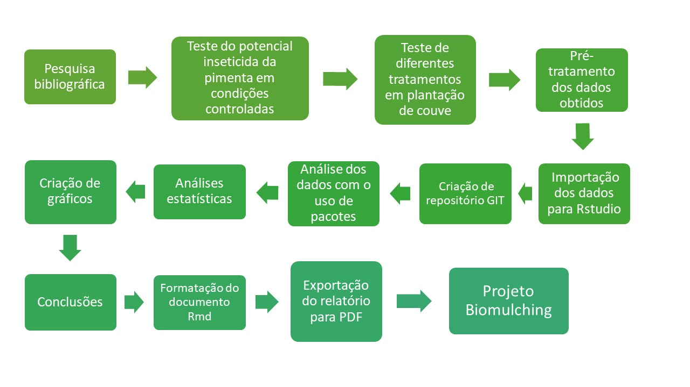
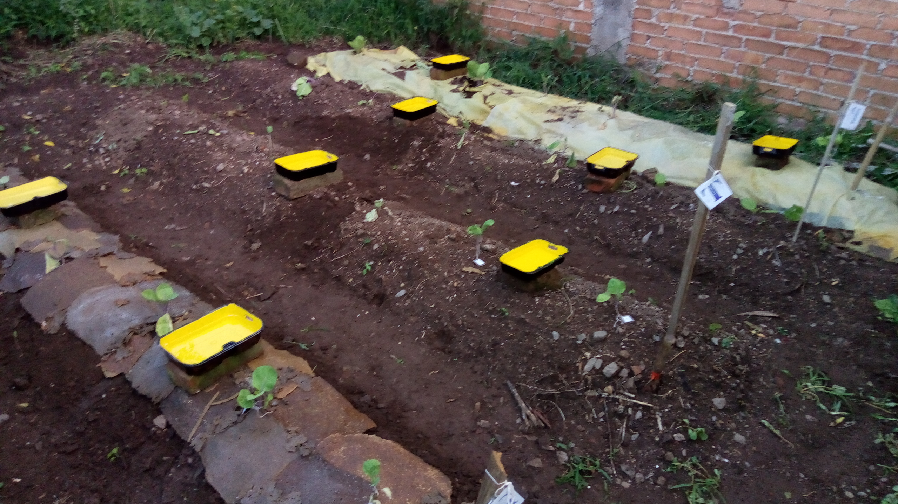

 
 
**Resumo:** O presente projeto foi desenvolvido com o objetivo de avaliar um novo método de controle de pragas, o _biomulching_. Este método consiste em uma cobertura para solo produzida a base de casca de laranja, com a agregação de extratos de pimenta malagueta _Capsicum frutensis_, o qual apresenta em sua essência compostos com atividade repelente e inseticida. Por meio de testes foi verificada a eficiência da essência de pimenta e do _biomulching_ contra pragas em couve, _Brassica oleracea_, em comparação com outros tratamentos e mulchings de coberturas de solo, tanto em condições de laboratório como em condições de campo. Os dados obtidos foram analisados seguindo o conceito de literal programming e utilizando pacotes da linguagem R no software Rstudio com o intuito de melhorar a reprodutibilidade da análise. O _biomulching_ obteve um resultado semelhante a outros tipos de mulching quanto a sua função como cobertura de solo, entretanto não é possível afirmar se existem benefícios em relação ao combate de insetos por meio da agregação de essência de pimenta malagueta. Todavia, o projeto contribui para a construção de uma agricultura mais sustentável diminuindo os impactos ao meio ambiente e a saúde humana.

**Palavras-chave:** Agrotóxico. _Biomulching_. Inseticida natural. Cobertura para o solo.


_**Abstract:** The present project was developed with the aim of evaluating a new pest control method, the biomulching. This method consists of a ground cover produced from orange peel, with the addition of extracts of chilli pepper Capsicum frutensis, which has in its essence compounds with repellent and insecticidal activity. Tests were made to verify the efficiency of pepper essence and biomulching against cabbage pests, Brassica oleracea, in comparison with other treatments and mulchings of soil covers, both in laboratory and field conditions. The data obtained were analyzed following the concept of literal programming and using R language packages in the Rstudio software in order to improve the reproducibility of the analysis. The biomulching obtained a similar result to other types of mulching regarding its function as a ground covering, however it is not possible to affirm whether there are benefits in relation to the combat of insects through the aggregation of chili pepper essence. However, the project contributes to the construction of a more sustainable agriculture, reducing impacts on the environment and human health._

_**Keywords:** Pesticide. Biomulching. Natural insecticide. Ground cover._


# Introdução

Com a preocupação cada vez maior por uma alimentação saudável e segura por parte da sociedade, o presente projeto avalia um possível novo método de proteger as plantas, diante do problema do uso indiscriminado de agrotóxicos em plantações, os quais se mal manuseados e aplicados excessivamente podem trazer inúmeros prejuízos à saúde humana e ao meio ambiente.

Dentre os malefícios destes, ao meio ambiente pode-se citar a contaminação do solo, água, ar, diminuição da biodiversidade, pragas resistentes, entre outros, além de tamanhos prejuízos à saúde, como intoxicação, câncer e diversas outras doenças causadas pela longa exposição a estas substâncias (**referencia!**).

Visando diminuir o uso de agrotóxicos e contribuir para uma agricultura mais sustentável e segura, o projeto busca validar a técnica do _biomulching_ com agregação de extratos de _Capsicumm Frutensis_ para o combate de pragas das _Brassicas_, especificamente, pulgões, lagartas e moscas brancas em couves. Esta técnica se baseia na união de outras duas, a de mulching ou cobertura de solo e de bioinseticida.
 
O uso de lonas para cobertura do solo é uma técnica bastante empregada atualmente, principalmente no cultivo de hortigranjeiros e na produção agroecológica pois seu uso traz benefícios como o controle da umidade e da temperatura do solo e impede o crescimento de plantas daninhas (**referencia!**). As essências de algumas plantas são usadas desde muitos séculos como defensivo agrícola e, atualmente, também como uma alternativa aos agrotóxicos comuns, sendo possível atingir as pragas sem trazer grandes danos às outras espécies presentes na natureza (**referencia!**). Em alguns casos, com a mesma eficiência dos agrotóxicos comuns, assim sendo mais seguro para o meio ambiente e a saúde humana. 

A utilização de ferramentas computacionais durante o processo de pesquisa reduz os possíveis erros de manipulação de dados e contribui com a reprodutibilidade da metodologia empregada, assim aumentando a confiança nos resultados e conclusões obtidas através dos experimentos. Ademais, outra técnica a qual pode auxiliar durante o uso de tais ferramentas é a de _literal programming_, onde descrevemos o que está sendo feito juntamente com os código e algoritmos que executam funções com os dados (**referencia!**). Isso permite um maior detalhamento da metodologia e controle das variáveis, o que também contribui para aumentar o nível de confiança numa pesquisa.


## Justificativa/Problema

O Brasil é um dos maiores produtores agrícolas do mundo e um dos que mais utiliza agrotóxicos. De acordo com a ANVISA, 51% dos alimentos contêm resíduos de agrotóxicos, isso sem considerar o glifosato, o pesticida mais utilizado no mundo. Hoje, dos 50 agrotóxicos mais utilizados no país 28 são proibidos em outros países, fora os que são contrabandeados e entram ilegalmente no país. (Campanha Nacional Contra os Agrotóxicos e Pela Vida, 2019). 

Um fato o qual não se pode negar é de que os agrotóxicos afetam a vida. De uma maneira positiva auxiliando no combate de pragas e protegendo as plantações contra perdas econômicas, sendo como uma forma de segurança para os produtores. Contudo, estes também irão afetar todos os outros seres vivos presentes no meio, os quais são benéficos para as plantas, para os seres humano e a natureza como um todo.

Estas substâncias quando má administradas pelos produtores pode causar uma série de malefícios à saúde humana, como intoxicação, desordens hormonais, doenças neurológicas e até mesmo alguns tipos de câncer podem ser favorecidos pela exposição desprotegida e excessiva aos agrotóxicos, (CASAL et. al., 2015). Além de tamanhos prejuízos à saúde, também há vários problemas ambientais que podem ser causados pelo uso indiscriminado destas substâncias. Entre elas estão a poluição do solo, da água, do ar, e consequentemente isso irá afetar os ecossistemas e a biodiversidade expostas a tais contaminantes (SOARES e PORTO, 2007), (CASAL et. al., 2015). 

Com todos estes problemas ocasionados pelo uso incorreto de pesticidas, evidencia-se uma necessidade por métodos alternativos aos agrotóxicos para promover uma agricultura mais saudável, sustentável e segura. Dentre as alternativas, está a utilização de bioinseticidas, óleos essenciais e extratos que estão presentes nas plantas aromáticas e podem apresentar atividade atraente, repelente, e até tóxica a insetos e microrganismos, (SALTO, 2004), (PICANÇO, 2010). Os produtos de plantas são considerados como menos problemáticos para o meio ambiente, devido a fácil decomposição, porém não deixam de ser componentes químicos, devendo seus efeitos serem estudados.  (SALTO, 2004). Entretanto, estes apresentam uma desvantagem em relação aos agrotóxicos convencionais, a necessidade do uso de maiores quantidades de princípio ativo e em maior número de aplicações. 

Uma outra alternativa aos agrotóxicos é a técnica de /mulching/, na qual consiste na cobertura do solo com algum material como folhas secas, jornal, TNT ou com o uso de lonas plásticas, as quais podem ser biodegradáveis ou não. O uso do mulching auxilia em múltiplos fatores durante o cultivo como o controle da umidade do solo, dos nutrientes, da temperatura do solo, de infestações de insetos e como uma barreira para o desenvolvimento de plantas invasoras (NETO, 2016), (CHIELLINI, 2002). Todos os fatores juntos promovem um crescimento das plantas mais rápido gerando maiores rendimentos e o produto é mais facilmente colido e limpo (CHIELLINI, 2002). Entretanto, esta técnica também apresenta suas desvantagens, como normalmente são utilizados mulchings plásticos, estes após um certo período começam e se rasgar e a se degradar em pequenos pedaços que permanecem dispersos no solo, assim perdendo sua utilidade. Este fato faz necessária a remoção do mulching, a qual pode ser difícil de ser realizada se este já estiver bastante degradado, e após a remoção ainda existirão os resíduos plásticos, que não são reciclados devido a presença de altas quantidades de terra e outros contaminantes como pesticidas (CHIELLINI, 2002).

<!-- # (vamos averiguar se podemos melhor gerenciar as referências bibliográficas) -->

Visando instigar o desenvolvimento de novos métodos de controle de pragas na agricultura, o presente projeto irá revisar os dados obtidos em um trabalho desenvolvido pelo aluno Mateus Colombo durante o Ensino Médio com o uso de pacotes de linguagem R. Em seu trabalho foi criado o _biomulching_ com agregação de extratos de pimenta malagueta, uma técnica alternativa aos agrotóxicos que consiste como cobertura de solo e de prevenção de controle de pragas em couve. Esta técnica une o princípio da cobertura de solo com o dos bioinseticidas, criando um mulching biodegradável, a base de casca de laranja, com a agregação de extratos de _Capsicum frutensis_ para a liberação controlada de sustâncias inseticidas durante o cultivo. Assim hipoteticamente auxiliando as plantas para um melhor desenvolvimento e garantindo uma boa colheita sem prejuízos econômicos.

Um ponto importante durante o desenvolvimento de um projeto de pesquisa é a correta análise dos dados obtidos e descrição dos processos. No projeto original, uma grande quantidade de dados sobre diversas variáveis e testes foram obtidas e processadas muitas vezes manualmente, o que poderia acabar gerando desorganização e erros, (WICKHAM, H, 2016) , os quais ao final poderiam consequentemente gerar conclusões imprecisas e indefinidas sobre o objeto de estudo.Através da análise correta dos dados obtidos dos experimentos, o trabalho de pesquisa ganha maior reprodutibilidade e confiança ao estudo que foi realizado. Uma proposta de solucionar os problemas causados na análise de dados por erros humanos é a utilização de softwares e outros programas de análise tais como o Rstudio.

Já para a parte de organização e descrição dos processos do projeto, Donald Knuth criou o conceito de _literal programing_ o qual é semelhante a um caderno de anotações digital. Com a programação literal são anotadas as informações sobre os procedimentos e o que acontece no projeto, escritas de uma forma esplicativa ao longo dos trechos com códigos, sendo a liguagem computacional com uma tradução para a linguagem humana. Assim torando o script mais fácil de entender, tanto às pessoas que possuem maior conhecimento sobre pragramação quanto às que não dominam muito essa área (**referencia!**). 

<!-- # (tu podes elaborar no sentido de apresentar o conceito de caderno de anotações digital com programação literal. No quesita da prog. literal, tu podes citar o trabalho do Donald Knuth (link da wikipedia: https://en.wikipedia.org/wiki/Literate_programming).) -->

# Métodos e materiais

No presente projeto em principio foram reorganizados os dados do projeto original para facilitar a sua manipulação através do software. Os dados brutos foram obtidos através de testes e controle de armadilhas e variáveis em teste em campo do _biomulching_ e também de um teste realizado em condições de laboratório para verificar como o principio ativo do _biomulching_, a essencia de pimenta, poderia se comportar em um teste com menos controle das variáveis como no caso do teste em condições de campo. 
posteriormente foram inseridos os dados e então analisádos juntamente com o conceito de _literal programing_. Para a parte dos resultados foram gerados gráficos e análises estatisticas conforme cada caso. 

Segue um fluxograma do trabalho desenvolvido durante o projeto de pesquisa:



## Teste em condições controladas da essência e do _biomulching_

O seguinte teste foi baseado na metodologia de Santos e Silva, 2015.

Material utilizado:
 
- 5 vidros
- Plástico filme
- 5 pedaços de papel toalha
- Repelente a base de icaridina
- Essência de pimenta na concentração de 5000 ppm
- Água

A proposta é a comparação entre a ação de um bioinseticida comercial, o extrato da pimenta, bio-mulching e a contraprova. Para assim verificar os efeitos e a eficiência do novo método.
Foram colocadas em cada vidro um papel toalha no fundo, juntamente com folhas de couve frescas sem pulgões. Após os pulgões foram coletados de couves e passados aproximadamente 150 pulgões para cada vidro. Então os vidros foram distribuídos da seguinte forma:

- 1 bioinseticida comercial (10 ml, sendo 5ml repelente a base de icaridina e 5ml de água)
- 1 extrato de pimenta (10ml da essência na concentração de 5000ppm)
- 1 bioplástico (protótipo 4, com 10ml de água)
- 2 contraprova (só com 10 ml de água)

Manteve-se a temperatura em torno de 25°C, com observações nos intervalos de 30min, 1h, 2h, 12h, 24h, 48h e 116h, após o início do teste.

## Teste do _biomulching_ em plantação de couve

Primeiramente o solo foi preparado com um mês de antecedência do início do teste, sendo feita a retirada de plantas invasoras, a aeração e aração do solo, com cerca de 20cm de profundidade. Após o solo foi adubado com cinzas, restos de alimentos, cal e esterco. Então foram dispostos cinco canteiros de aproximadamente 0,5m X 2,5m, totalizando cerca de 15m², nos quais foram plantados cinco pés de couve (_Brassica oleracea_) no espaçamento de 50cm X 1m em cada canteiro. Foram plantadas 25 mudas de couve, as quais haviam sido cultivadas a partir de ramos de outras plantas. 

Legenda:

G = Canteiro com _biomulching_

T = Canteiro de contraprova

P = Canteiro com aplicação de essência de pimenta

S = Canteiro com lona plástica amarela

X = Canteiro com lona plástica preta

Para a cobertura do canteiro com o _biomulching_, foram utilizados  pedaços pequenos do protótipo de _biomulching_ produzido a base de casa de laranja e outros componentes com a agregação de extrato de pimenta malagueta (_Capsicum frutencis_), totalizando a área de 1m². Depois de produzidos foram armazenados em sacos plásticos até o momento de aplicação na plantação, quando foram dispostos sobre o solo um ao lado de outro, entre as couves, formando a área de cobertura de 1m². Também foram dispostas as coberturas de mulching amarelo e preto sobre os canteiros S e X, respectivamente.
O controle deste teste foi realizado do dia 17 de dezembro de 2018 até o dia 11 de março de 2019, totalizando o período de 84 dias.

O controle do experimento foi baseado no trabalho de (NETO, 2016)., sendo feitas algumas alterações conforme a disponibilidade dos equipamentos presentes no laboratório e a praticidade durante o experimento em campo.

 Para o experimento foram analisadas as seguintes variáveis conforme descritas:

- Temperatura: 
Controle por meio dos dados da estação meteorológica de Garibaldi (estação do aeroclube). As medições foram realizadas sempre as 14:00 horas de cada dia. 

- Umidade relativa do ar: 
Controle por meio dos dados da estação meteorológica de Garibaldi (estação do aeroclube). As medições foram realizadas sempre as 14:00 horas de cada dia. 

- Umidade do solo: 
Controle a cada três dias por amostra do solo coletada a 10cm de profundidade e analisada pelo método da frigideira conforme: **https://www.youtube.com/watch?v=2OmsbVF9O88**.
A terra era peneirada, depois pesada e então colocada na frigideira e aquecida até estar seca, em torno de 10 minutos em fogo alto. Depois deixou-se esfriar e então pesa-se a amostra de terra seca e calcula-se a diferença de massa para obter o percentual de umidade do solo.
Pelo fato de o método da frigideira ser pouco confiável, utilizou-se uma formula para correção do percentual de umidade obtido. Para tal utilizou-se a seguinte fórmula:
(percentual obtido x 0,9778) – 2,6095 = percentual corrigido.

- pH do solo: 
Por meio de amostra do solo analisado em laboratório com uso da fita de pH.

- Número de plantas invasoras:
 Controle semanal com a contagem das plantas invasoras e demarcação através de mapeamento.

- Massa foliar:
Aferição da massa total (caule e folhas) e consumível (folhas saudáveis) das plantas após a colheita. 

- Porte das plantas:
Medição de altura nas semanas, 9, 11 e 12, além disso foi aferido o tamanho máximo médio das folhas ao final experimento.

- Degradação do bio-mulching: 
Medição semanal da área com presença do _biomulching_.

- Quantidade de pulgões alados , outros insetos e inimigos naturais:
Para o monitoramento da população de pulgões alados e outros insetos foi utilizado o método de armadilha com bandejas de água desenvolvida por Moerick (Rezende, 2007). As bandejas foram pintadas de amarelo, para atrair os insetos foi usado o estímulo visual da radiação amarela refletiva.
As armadilhas foram confeccionadas usando bandejas plásticas com 1 litro de capacidade, pintadas internamente de amarelo. Em cada bandeja foi colocado 500 ml de água e 2 gotas de detergente, para quebrar a tensão superficial, foram cobertos por uma proteção de organza para evitar perda de material em caso de transbordamento e foram instaladas na altura do dossel das plantas. O controle foi feito a cada 3 dias sendo utilizadas duas armadilhas por canteiro.



## Pré tratamento dos dados do projeto do _biomulching_

Nesta etapa os dados coletados do projeto de desenvolvimento do _biomulching_, os quais estavam em tabelas no formato xlsx, foram organizados com o objetivo de facilidar a leitura das tabela pelo programa Rstudio. Para tanto, criaram-se novas tabelas organizando os dados em colunas continuas e com cada célula corespondendo a uma unica observação. Removeran-se informações referentes a plotagem de gráficos e outras não pertinentes aos dados brutos. Mantiveram-se a separação dos dados entre as pastas já existentes no arquivo.


## Importação e organização dos dados para o Rstudio

Para transferir os dados para o Rstudio utilizou-se o comando "read_xlsx" do pacote tidyverse, por meio do qual foram lidas as tabelas em xlsx onde estavam os dados. Para cada conjunto de dados referentes as diferentes variáveis e testes foi criado uma referencia começando por "df." seguido do nome para identificar o conjunto de dados. Alguns conjuntos ainda foram reformatados para uma melhor organização e também para adicionar o código/legenda referente aos tratamentos utilizados no projeto.

 Foram utilizados os seguintes pacotes de linguagem R para a importação e organização dos dados: 

library(tidyverse);
library(readxl);
library(lubridate).

```{r pacotes, include=FALSE}
#carrega os pacotes necessários.
library(tidyverse)
library(readxl)
library(lubridate)

#cria legenda dos tratamentos para o teste em plantação de couve.
tribble (
  ~Código, ~Prevenção,
  "G", "_biomulching_",
  "T", "Contraprova",
  "P", "Pimenta",
  "S", "Lona Amarela",
  "X", "Lona Preta") -> df.legenda

```

### Presença de insetos na plantação de couve
 
 Foram importados os seguintes conjuntos dados, os quais foram armazenados em "df.armadilhas":
 
 -Quantidade de pulgões capturados nas armadilhas;

 -Quantidade de outros insetos capturados nas armadilhas;

 -Quantidade de inimigos naturais capturados nas armadilhas;

 -Presença de outros agentes prejudiciais:
 Os dados correspondem a contagem de moscas e lagartas encotrados nas couves durante o periodo de 30 dias, um mês. A data de inicio da contagem foi o dia de inicio do experimento, a primeira contagem sendo realizada no 30º dia 16/01/2019), a segunda no 60º dia (15/02/2019) e o ultio no 83º dia (10/03/2019). Os dados obtidos eram sempre atualizados ao final dos 30 dias pois o número desses insetos era pequeno.
 
  
 Para a realização desta etapa primeiramente foram criadas as variáveis de semana e dia para adicionar aos dados das armadilhas. Também foi criada uma referência para os dias nos quais ocorreu a atualização da presença de outros agentes perjudiciais.
 Então os dados correspondentes às moscas e lagartas foram inseridos, agregaram-se os valores de dia e mês, retirou-se a coluna do mês e adicionou-se a legenda para os códigos de cada prevenção.
 Posteriormente foram inseridos os dados obtidos por meio das armadilhas, onde estavam os valores de pulgões, outros insetos e inimigos naturais. Juntaram-se todos os dados em um unico conjunto de dados e modificou-se a organização das colunas das prevenções para ocuparem apenas uma coluna. Removeram-se as referências sem valores e a coluna das semanas. Então foi adicionada a legenda para os diferentes códigos das prevenções e finalmente adicionou-se os valores de moscas e lagartas para formar apenas um conjunto de dados com todos os agentes.
 
```{r pragas, include=FALSE}


read_xlsx("Dados biomulching para análise.xlsx", 
          sheet="armadilhas", 
          range="A3:A26") -> df.semana

read_xlsx("Dados biomulching para análise.xlsx", 
          sheet="armadilhas", 
          range = "Q3:Q26") -> df.dia

tribble (~mês, ~Dia,
         "1", "2019-01-16",
         "2", "2019-02-15",
         "3", "2019-03-11",) -> df.dia.mês


read_xlsx("Dados biomulching para análise.xlsx", 
          sheet = "plantas", 
          range = "A2:D17") %>%
  rename(Prevenção = `Canteiro`)%>%
  pivot_longer(cols = mosca:lagarta,
               names_to="Agente",
               values_to="Quantidade")%>%
  mutate(mês = as.character(mês))%>%
  left_join(df.dia.mês, by= "mês")%>%
  mutate(Dia = as_datetime(Dia))%>%
  select(-mês)%>%
  rename(Código = Prevenção)%>%
  left_join(df.legenda, by="Código")-> df.prejudiciais

bind_rows( 
    read_xlsx("Dados biomulching para análise.xlsx", 
              sheet = "armadilhas", 
              range = "B3:F26") %>% 
     mutate(Agente = "Pulgões") %>%
     bind_cols(df.semana, df.dia),
             
    read_xlsx("Dados biomulching para análise.xlsx", 
              sheet = "armadilhas", 
              range = "G3:K26") %>%
      mutate(Agente = "Outros") %>%
      bind_cols(df.semana, df.dia),
    
    read_xlsx("Dados biomulching para análise.xlsx",
              sheet = "armadilhas", 
              range = "L3:P26") %>%
      mutate(Agente = "Naturais") %>%
      bind_cols(df.semana, df.dia)) %>%
  
  pivot_longer(cols = T:X,
               names_to="Prevenção",
               values_to="Quantidade") %>%
  filter(!is.na(Quantidade)) %>%
  select(-`semana`)%>%
  rename(Código = Prevenção) %>%
  left_join (df.legenda, by="Código")%>%
  bind_rows(df.prejudiciais)-> df.armadilhas

```

### Dados a respeito das condições climáticas ao longo do período experimental
 
 Foram importados os seguintes conjuntos dados os quais foram armazenados em "df.clima":
 
 -Temperatura ao longo do período experimental;

 -Umidade atmosférica ao longo do período experimental;

 Para os valores de umidade do solo foi criado um diretório a parte, onde forma realizados cálculos a partir dos valores originais para crear os valores corrigidos do percentual de umidade do solo. Os valores foram armazenados em "df.umidade_solo".

 -Umidade do solo ao longo do período experimental:
 Para o cálculo do percentual corrigido da umidade do solo foi utilizada a seguinte equação:
 
 Diferença = (massa umida) - (massa seca)
 Água/100g = (Diferença * 100)/(massa umida)
 Percentual corrigido = (((água/100g)*0.9778)-2.6095)*0,01


```{r clima, include=FALSE}

read_xlsx("Dados biomulching para análise.xlsx", 
          sheet = "umidade", 
          range = "I2:J87") %>%
  rename(umidade = `unidade`)%>%
  bind_cols(
    read_xlsx("Dados biomulching para análise.xlsx", 
          sheet = "temperatura", 
          range = "B2:B87")) -> df.clima

read_xlsx("Dados biomulching para análise.xlsx", 
          sheet = "umidade", 
          range = "A2:D108")%>%
  mutate(`diferença (g)` = `massa umida (g)` - `massa final (g)`)%>%
  mutate(`água/100g` = (`diferença (g)`*100)/`massa umida (g)`)%>%
  mutate(`percentual corrigido` = ((`água/100g`*0.9778)-2.6095)*0.01)%>%
  mutate(`percentual corrigido` = as.numeric(`percentual corrigido`))%>%
  rename(Código = Prevenção) %>%
  left_join (df.legenda, by="Código")-> df.umidade_solo

```

### Quantidade de plantas invasoras ao longo do período experimental
 
 Foram importados os seguintes conjuntos dados os quais foram armazenados em "df.plantas_invasoras":
 
 -Número de plantas invasoras presentes em cada canteiros ao longo do período experimental:
 Foi criada uma tibble para adicionar os dias em que foram realizadas as medições a cada semana. Adicionou-se a legenda dos diferentes tratamentos e removeu-se a coluna da semana.
 
```{r invasoras, include=FALSE}
tibble (semana = 1:11) %>%
  mutate(Dia = ymd("2018-12-27") + days((semana -1) * 7)) %>%
  bind_rows(tibble (semana = max(.$semana) + 1,
                    Dia = max(.$Dia) + days(4))) -> df.dia.semana

read_xlsx("Dados biomulching para análise.xlsx", 
          sheet = "degradação", 
          range = "K2:N62")%>%
  select(-`presença invasoras`)%>%
  left_join(df.dia.semana, by= "semana")%>%
  select(-`semana`)%>%
  rename(Quantidade = quantidade)%>%
  mutate(Dia = as_datetime(Dia))%>%
  rename(Código = Prevenção) %>%
  left_join (df.legenda, by="Código")-> df.plantas_invasoras

```

### Dados das plantas de couve

Foram importados os seguintes conjuntos dados os quais foram armazenados em "df.dados_plantas":

 -Altura das couves:
 Corresponde aos valores obtidos em três medições da altura de cada couve nos diferentes tratamentos. Inicialmente estes valores foram lidos separados do restante e após alguns ajustes na organização das colunas e nomenclatura, estes foram adicionados em um grupo junto com os valores das outras variáveis. A referência "altura" foi substituido por "valor"
 
 -Massa folhar total das couves ao final do periodo experimental: A referência "massa total (g)" foi substituido por "valor" para facilitar na união dos dados em um unico conjunto.
 
 -Massa folhar comestível das couves ao final do periodo experimental: A referência "massa comestivel (g)" foi substituido por "valor" para facilitar na união dos dados em um unico conjunto.
 
 -Tamanho médio máximo das folhas de couve:
 Corresponde ao valor médio máxima das folhas de cada couve em cada um dos diferentes tratamentos ao final do período experimental. A referência "tamanho" foi substituido por "valor" para facilitar na união dos dados em um unico conjunto.

```{r plantas, include=FALSE}

read_xlsx("Dados biomulching para análise.xlsx", 
          sheet = "degradação",
          range = "E2:H74")%>%
  rename(Valor = altura)%>%
  rename(Dia = dia)%>%
  mutate(Observação = "altura")%>%
  rename(Código = Prevenção) %>%
  left_join (df.legenda, by="Código")-> df.altura


bind_rows( 
  read_xlsx("Dados biomulching para análise.xlsx", 
            sheet = "solo", 
            range = "E2:G26") %>%
    mutate(Observação = "massa total (g)"),
             
  read_xlsx("Dados biomulching para análise.xlsx", 
            sheet = "solo",
            range = "I2:K26") %>%
    mutate(Observação = "massa comestível (g)"),
  
  read_xlsx("Dados biomulching para análise.xlsx", 
            sheet = "solo", 
            range = "A2:C26") %>%
    mutate(Observação = "tamanho (cm)")%>%
  rename(`massa (g)` = `tamanho`))%>%
  rename(`Valor` = `massa (g)`)%>%
  mutate(`Dia` = ymd_hms("2019-03-11 00:00:00"))%>%
  rename(Código = Canteiro) %>%
  left_join (df.legenda, by="Código")%>%
  bind_rows(df.altura)-> df.dados_plantas

```

### Degradação do protótipo de _biomulching_
 
Foram importados os seguintes conjuntos dados os quais foram armazenados em "df.degradação":

 -Percentual total da área degradada a cada semana durante o período experimental:
 Foram alterados os valores de Percentual de degração para valor em porcentagem de degradação dividindo o valor original por 100. Após foram retidas as colunas "semana" e "Percentual de degradação" para uma melhor comparação com os demais dados.

```{r degradação, include=FALSE}
read_xlsx("Dados biomulching para análise.xlsx", 
          sheet = "degradação", 
          range = "A2:C14")%>%
  mutate(`Porcentagem de degradação` = `Percentual de degradação`/100)%>%
  select(-"semana",-"Percentual de degradação")%>%
  rename(Dia = dia)-> df.degradaçao

```
 
### Dados do experimento em condições controladas

Foram importados os seguintes conjuntos dados os quais foram armazenados em "df.controlado":

 -Quantidade de pulgões vivos ao longo do tempo;
 
 -Quantidade de pulgões mortos ao longo do tempo.

Legenda:

- C = Controle 1
- C+ = Controle 2
- B = _biomulching_
- I = Icaridina
- E = Essência de pimenta

Inicialmente foi criado uma legenda com o intuito de melhorar a interpretação dos dados ao gerar os gráficos. Depois os dados foram reorganizados de forma que os diferentes tratamentos fossem reunidos em uma coluna.

```{r controlado, include=FALSE}
tribble (~Código, ~Tratamento,
         "C", "Contraprova #1",
         "C+", "Contraprova #2",
         "B", "_biomulching_",
         "I", "Icaridina",
         "E", "Essência de Pimenta") -> df.controlado.legenda

bind_rows(
  read_xlsx("Dados biomulching para análise.xlsx", 
            sheet = "controlado", 
            range = "A2:F11") %>%
    mutate(Estado = "vivos") %>%
    pivot_longer(cols = C:E,
               names_to="Tratamento",
               values_to="Quantidade"),
  
  read_xlsx("Dados biomulching para análise.xlsx", 
            sheet = "controlado", 
            range = "I2:N11") %>%
    mutate(Estado = "mortos") %>%
    pivot_longer(cols = C:E,
               names_to="Tratamento",
               values_to="Quantidade")) %>%
  rename(Código = Tratamento) %>%
  left_join(df.controlado.legenda, by="Código")-> df.controlado

```

# Resultados

A partir a obtenção, reorganização e ajustes e importação dos dados para o Rstudio, seguimos com a seguinte análise de resultados para as diferentes hipóteses e conjunto de dados de interesse. Para tanto os dados são apresentados na forma de gráficos.

## Teste em condições controladas

Após realizado o teste obtiveram-se os resultados do número de pulgões vivos e mortos em cada tratamento. Notou-se que a essência de pimenta conseguiu atingir um resultado satisfatório, visto que matou todos os pulgões em cerca de duas horas na concentração de 5000ppm. Já o tratamento à base de icaridina também conseguiu eliminar totalmente a população de pulgões, contudo, foi observado que após a aplicação do repelente a base de icaridina, a folha de couve teve alterações em sua coloração e em características físicas, ficando com uma coloração amarelada e murcha.
Também se verificou que nas amostras de controle e do tratamento com o _biomulching_ ocorreu uma proliferação de pulgões após 48horas, aumentando o número total de pulgões vivos nas amostras conforme evidencia a figura abaixo (Figura 1):

```{r lab, echo=FALSE, fig.cap="Figura 1. Fonte o autor, Porto Alegre - RS, 2021"}

df.controlado %>%
  pivot_wider(names_from="Estado", values_from="Quantidade") %>%
  mutate(populacao = vivos+mortos) %>%
  group_by(Tratamento) %>%
  mutate(crescimento = populacao - min(populacao)) %>%
  ggplot(aes(x=`Tempo (h)`, y = vivos, color=Tratamento))+
  geom_line() +
  geom_point() +
  scale_y_continuous(breaks = seq(0, 200, by = 20)) +
  ggtitle("Crescimento da pupulção de pulgões em cada tratamento ao longo do tempo") +
  ylab("Número de pulgões vivos") +
  scale_x_continuous(breaks = seq(0, 200, by = 12))

```
Quanto ao tratamento com o _biomulching_, este não teve resultado semelhante quando comparados aos tratamentos com a essência de pimenta e icaridina. O que pode se relacionar ao fato de o _biomulching_ não ter se degradado completamente, ou a outros fatores ainda desconhecidos. Contudo mostra certa redução do número de pulgões quando comparado com as amostras de controle.

Também se verificou a eficiência de cada método através da fórmula de Abbott, sendo os resultados apresentados na tabela abaixo:

Fórmula de Abbott:

E % = ((T-Tr)/T)x100

onde:

T = média dos valores de contraprova

Tr = tratamento

```{r echo=FALSE, fig.cap="Tabela 1. Fonte o autor, Porto Alegre - RS, 2021"}
df.controlado %>%
  filter(`Tempo (h)` == "116") %>%
  filter(Estado %in% c("vivos")) %>%
  filter(grepl("Contraprova", Tratamento)) %>%
  pull(Quantidade) %>% mean -> media_contraprova


df.controlado %>%
  filter(`Tempo (h)` == "116") %>%
  filter(Estado %in% c("vivos")) %>%
  filter(Tratamento %in% c("_biomulching_", "Icaridina", "Essência de Pimenta")) %>%
  mutate("Eficiência (%)" = round((122.5 - Quantidade)/122.5*100, 0))
```

## Teste em plantação de couve

### Condições climáticas

#### Temperatura

Os dados relativos à temperatura média e a umidade relativa do ar registrada diariamente às 14:00hrs durante o período de realização do estudo (17 de dezembro de 2018 a 11 de março de 2019), são apresentados nas Figuras 2 e 3. A temperatura média do ar durante o período experimental foi de 25,22°C.

```{r echo=FALSE, fig.cap="Figura 2. Fonte: Estação Meteorológica do aeroclube, Garibaldi - RS, 2018/2019"}
df.clima%>%
  ggplot(aes(x = dia, y = temperatura))+
  geom_point()+
  geom_line()+
  ylim(0, NA) +
  #scale_y_continuous(breaks = seq(0, 40, by = 2))+
  ggtitle("Temperatura do ar às 14:00hrs ao longo do período experimental") +
  xlab("Dia") +
  ylab("Temperatura")

#df.clima %>%
 # select(temperatura)%>%
  #summarise(mean(temperatura)) -> temperatura_média
```
#### Umidade

Quanto à umidade relativa do ar, está esteve elevada em algumas semanas e baixa em outras, o que consequentemente afetava a umidade do solo. Sua média foi de 77%.

```{r echo=FALSE, fig.cap="Figura 3. Fonte: Estação Meteorológica do aeroclube, Garibaldi - RS, 2018/2019"}

df.clima%>%
  ggplot(aes(x = dia, y = umidade))+
  geom_point()+
  geom_line()+
  ylim(0, NA) +
  ggtitle("Umidade relativa do ar às 14:00hrs ao longo do período experimental") +
  xlab("Dia") +
  ylab("Umidade")

#df.clima %>%
#  select(umidade)%>%
#  summarise(mean(umidade)) -> umidade_média

```
### Umidade do solo

Conforme a figura 4, os valores de umidade do solo alternaram entre a faixa de cerca de 10% até cerca de 27% e, não é possivel verificar se há alguma diferença na umidade do solo entre os canteiros. Contudo é possivel observar que ouveram varios momentos com oscilações em todos os canteiros, tanto nos com cobertura do solo quanto naqueles sem cobertura, o que pode estar relacionado com a umidade relativa do ar do periodo em questão. O canteiro com menos oscilações foi o com cobertura de lona preta e o com menor amplitude foi o canteiro do _biomulching_.

Isto pode estar relacionado com o fato de o _biomulching_ ser compostos principalmente de cascas de laranja, estas conseguem absorver a umidade do ambiente e mantê-la por mais tempo. Enquanto o mulching convencional de plástico é impermeável, caso não aconteça uma boa irrigação, nem escassa e nem em excesso, haverá maior variação na umidade do solo, alternando entre periodos com menor umidade ou maior umidade.

```{r fig4, echo=FALSE, fig.cap="Figura 4. Fonte o autor, Porto Alegre - RS, 2021"}
df.umidade_solo %>%
  ggplot(aes(x =Dia, y = `percentual corrigido`, color = Dia))+
  geom_point()+
  geom_line()+
  facet_wrap(~Prevenção, nrow=1)+
  ylim(0, NA)+
  ggtitle("Percentual da umidade do solo através do tempo")+
  ylab("Percentual de umidade")

```
Para confirmar se há diferenças na umidade do solo entre os canteiro, foi realizada análise de variancia (One-way ANOVA) e o teste de Tukey. Conforme a Figura 5, onde consta o resultado do teste de Tukey, não há diferenças significativas a 95% de confiança entre os valores da umidade do solo dos canteiros.

```{r gig5, echo=FALSE, fig.cap="Figura 5. Teste Tukey para umidade do solo. Fonte o autor, Porto Alegre - RS, 2021"}

aov(lm(`percentual corrigido`~Código, data= df.umidade_solo)) -> solo_anova

#resume o resultado da anova
#summary(solo_anova)

#imprime o teste Tukey
#TukeyHSD(solo_anova)

plot(TukeyHSD(solo_anova, conf.level=.95), las = 2)

```

### Presença de plantas invasoras

A presença de plantas invasoras nos canteiros foi, de uma maneira geral, controlada significativamente pelo tipo de cobertura utilizado no canteiro. Percebe-se que o controle das plantas invasoras foi eficiente no solo com coberturas de plástico e bio-mulching, quando comparados com o solo sem cobertura dos canteiros de controle e pimenta.

```{r fig6, echo=FALSE, fig.cap="Figura 6. Fonte o autor, Porto Alegre - RS, 2021"}
df.plantas_invasoras %>%
  filter(grepl("2019-03-11", Dia)) %>%
  ggplot(aes(x = Prevenção, y = Quantidade, fill = Prevenção))+
  geom_bar(stat = "identity", width=.5, position = "dodge")+
  scale_y_continuous(breaks = seq(0, 1000, by = 20))+
  ggtitle("Número total de plantas invasoras em cada canteiro")+
  ylab("Quantidade de plantas invasoras em 1,25m²")

df.plantas_invasoras %>%
  #filter(grepl("2019-03-11", Dia)) %>%
  ggplot(aes(x = Dia, y = Quantidade, color = Prevenção))+
  geom_point()+
  geom_line()+
  scale_y_continuous(breaks = seq(0, 1000, by = 20))+
  ggtitle("Número total de plantas invasoras em cada canteiro")+
  ylab("Quantidade de plantas invasoras em 1,25m²")

```
```{r  echo=FALSE, fig.cap="Tabela 2. Fonte o autor, Porto Alegre - RS, 2021"}

df.plantas_invasoras %>%
  filter(grepl("2019-03-11", Dia)) %>%
  filter(Prevenção%in% c("Contraprova", "Pimenta")) %>%
  pull(Quantidade) %>% mean -> media_semcobert

df.plantas_invasoras %>%
  filter(grepl("2019-03-11", Dia)) %>%
  filter(Prevenção%in% c("_biomulching_", "Lona Preta", "Lona Amarela")) %>%
  mutate("Eficiência (%)" = 100- round((100*`Quantidade`)/media_semcobert, 0)) %>%
  select(-"Código", -"Quantidade", -"Dia")

```

Comparando os números de plantas invasoras determinados no solo sem cobertura e com coberturas de lona amarela, lona preta e bio-mulching, nota-se que a lona preta reduziu a infestação das plantas invasoras em 89%, a lona amarela em 75% e o _biomulching_ em 61%. O fato de o bio-mulching ter tido um desempenho inferior deve-se a sua degradação, que chegou a 82% no período de 84 dias, conforme mostra a Figura 7. O que através do tempo reduziu a área de proteção do solo, assim permitindo o crescimento de plantas invasoras.

```{r degradabilidade, echo=FALSE, fig.cap="Figura 7. Fonte o autor, Porto Alegre - RS, 2021"}

df.degradaçao %>%
  ggplot(aes(x = Dia, y = `Porcentagem de degradação`))+
  geom_point()+
  geom_line()+
  scale_y_continuous(breaks = seq(0, 1, by = 0.1))+
  ggtitle("Degradação do Biomulching ao longo do tempo")

``` 

Conforme vemos no gráfico \@ref(fig:degradabilidade), houve um pico de degradação no mês de janeiro, ao entrar no mês de fevereiro, o percentual já estava em cerca de 60%. Contudo, após esse periodo teve o ritmo de degradação reduzido. Chegando ao final do periodo experimental, após 84 dias, com o _biomulching_ degradado em mais de 80%.


### Desenvolvimento das plantas 

<!-- # (precisa separar melhor as perguntas de acordo com o que está sendo feito.) -->

Existe diferença no crescimento e rendimento na produção de couve? Se sim, quais os tratamentos mais significativos.
Qual o rendimento médio de produção de massa comestível?

Qual o canteiro que mais produziu? (isso significa, qual teve a maior quantidade de massa total)

Qual o tamanho máximo médio das folhas? *isso é bom ou ruim?*

O _biomulching_ estimula ou inibe o crescimento da couve?
A presença de pulgões afeta o crescimento e rendimento do cultivo de couve? Ou existe algum outro fator externo com maior influência?


```{r}
df.dados_plantas%>%
  filter(Observação == "massa total (g)")%>%
  group_by(Prevenção)%>%
  summarize(N=n(),
            Massa.Média = mean(Valor),
            Massa.SD = sd(Valor),
            Massa.SE = 3 * Massa.SD / sqrt(N)) %>%
  ggplot(aes(x = Prevenção, y = Massa.Média, fill = Prevenção))+
  geom_bar(stat = "identity", width=.5, position = "dodge")+
  geom_point()+
  geom_errorbar(aes(ymin = Massa.Média - Massa.SE,
                    ymax = Massa.Média + Massa.SE), width = 0.2) +
  ggtitle("Massa total média de cada canteiro")+
  ylab("Massa (g)")

```

```{r}
df.dados_plantas%>%
  filter(Observação == "massa comestível (g)")%>%
  group_by(Prevenção)%>%
  summarize(N=n(),
            Massa.Média = mean(Valor),
            Massa.SD = sd(Valor),
            Massa.SE = 3 * Massa.SD / sqrt(N)) %>%
  ggplot(aes(x = Prevenção, y = Massa.Média, fill = Prevenção))+
  geom_bar(stat = "identity", width=.5, position = "dodge")+
  geom_point()+
  geom_errorbar(aes(ymin = Massa.Média - Massa.SE,
                    ymax = Massa.Média + Massa.SE), width = 0.2) +
  ggtitle("Massa comestível média de cada canteiro")+
  ylab("Massa (g)")
```


```{r echo=FALSE}
df.dados_plantas%>%
    print %>%
  filter(grepl("tamanho", Observação)) %>%
  group_by(Prevenção) %>%
  summarize(N=n(),
            Tamanho.Média = mean(Valor),
            Tamanho.SD = sd(Valor),
            Tamanho.SE = 3 * Tamanho.SD / sqrt(N)) %>%
  ggplot(aes(x = Prevenção, y = Tamanho.Média)) +
  geom_bar(stat = "identity", width=.5, position = "dodge")+
  geom_point() +
  geom_errorbar(aes(ymin = Tamanho.Média - Tamanho.SE,
                    ymax = Tamanho.Média + Tamanho.SE), width = 0.2) +
  ylim(0, NA) +
  ylab("Tamanho Médio (cm)") +
  ggtitle("Tamanho médio das folhas de couve em cada canteiro")

```

O gráfico indica que não há diferença estatística no tamanho das cauves entre os diferentes canteiros. Mesmo assim, fizemos o teste estatístico student-t  para confirmar par a par se existe ou não tal diferença:

```{r teste t}
df.dados_plantas%>%
  filter(grepl("tamanho", Observação)) -> dados_tamanho

aov(Valor~Prevenção, data= dados_tamanho) -> tamanho_anova

summary(tamanho_anova)

TukeyHSD(tamanho_anova)

plot(TukeyHSD(tamanho_anova, conf.level=.95), las = 2)

```


```{r}
df.dados_plantas%>%
  filter(Observação == "altura")%>%
  group_by(Prevenção)%>%
  summarize(N=n(),
            Altura.Média = mean(Valor),
            Altura.SD = sd(Valor),
            Altura.SE = 3 * Altura.SD / sqrt(N)) %>%
  ggplot(aes(x = Prevenção, y = Altura.Média, fill = Prevenção))+
  geom_bar(stat = "identity", width=.5, position = "dodge")+
  geom_point()+
  geom_errorbar(aes(ymin = Altura.Média - Altura.SE,
                    ymax = Altura.Média + Altura.SE), width = 0.2) +
  ggtitle("Altura média das couves em cada canteiro")+
  ylab("Altura (cm)")
```


### Presença de pragas, outros insetos e inimigos naturais na plantação de couve

A essência de pimento por si só, auxilia no controle dos pulgões?
O _biomulching_ contribui para reduzir a população de pulgões? E de moscas e lagartas?
O _biomulching_ contribui para reduzir a população de outros insetos?
O _biomulching_ afeta a presença de inimigos naturais? Se sim, negativamente ou positivamente?

```{r pulgões, echo=FALSE, fig.cap="Figura 2. Fonte o autor, Porto Alegre - RS, 2021"}

df.armadilhas %>%
  filter(Agente == "Pulgões")%>%
  ggplot(aes(x = Dia, y = Quantidade, color = Prevenção)) +
  geom_line() +
  geom_point() +
  ylim(0, NA) +
  ggtitle("Quantidade de pulgões capturados nas armadilhas nos diferentes tratamentos")

```

```{r pulgoes_anova, echo=FALSE, fig.cap="Figura 3. Fonte o autor, Porto Algre - RS, 2021"}
df.armadilhas %>%
  filter(Agente == "Pulgões")->dados_pulgoes

aov(lm(Quantidade~Código, data= dados_pulgoes)) -> pulgoes_anova

summary(pulgoes_anova)

TukeyHSD(pulgoes_anova)

plot(TukeyHSD(pulgoes_anova, conf.level=.95), las = 2)
```

```{r, echo=FALSE, fig.cap="Figura 4. Fonte o autor, Porto Algre - RS, 2021"}

medias <- with(dados_pulgoes,tapply(Quantidade,Prevenção,mean)) 
erro <- with(dados_pulgoes,tapply(Quantidade,Prevenção,function(x) sqrt(var(x)/length(x))))

x <- barplot(medias,beside=T,ylim=c(0,25),ylab="Quantidade",xlab="Prevenção")
       arrows(x0=x,y0=medias-erro,
       x1=x,y1=medias+erro,
       angle=90,length=0.14,code=3)
       
```

Conforme observação da Figura \@ref(fig:pulgões), há uma diferença significativa no tratamento que utilizou o mulching convencional amarelo, o qual teve a menor contagem do número de pulgões.

```{r outros, echo=FALSE, fig.cap="Figura 5. Fonte o autor, Porto Algre - RS, 2021"}
df.armadilhas %>%
  # Vamos filtrar observações com outros
  filter(Agente %in% c("Outros")) %>%
  ggplot(aes(x = Dia, y = Quantidade, color=Prevenção)) +
  geom_line() +
  geom_point() +
  ylim(0, NA)+
  ggtitle("Quantidade de outros insetos capturados nas armadilhas ao longo do tempo") +
  ylab("Número de outros insetos")

```

```{r, echo=FALSE, fig.cap="Figura 6. Fonte o autor, Porto Algre - RS, 2021"}

df.armadilhas %>%
  # Vamos filtrar observações com outros
  filter(Agente %in% c("Outros")) -> dados_outros

aov(Quantidade~Código, data= dados_outros) -> outros_anova

summary(outros_anova)

TukeyHSD(outros_anova)

plot(TukeyHSD(outros_anova, conf.level=.95), las = 2)

```

Analisando o gráfico do número de outros insetos, pode-se visualizar uma tendencia para um menor numero no canteiro com lona amarela, nos demais canteiros não é possivil distinguir se há diferenças. Ou seja, não é possivél afirmar se o _biomulching_ contribui para a redução do número de outros insetos.

```{r pimenta, echo=FALSE, fig.cap="Figura 7. Fonte o autor, Porto Algre - RS, 2021"}

df.armadilhas %>%
  # Vamos filtrar observações com a essência de pimenta
  filter(Código %in% c("P","T")) %>% 
  # Vamos filtrar observações com os pulgões
  filter(Agente == "Pulgões") %>%
  ggplot(aes(x = Dia, y = Quantidade, color=Prevenção)) +
  geom_line() +
  geom_point() +
  ylim(0, NA) +
  geom_smooth(method="lm")+
  ggtitle("Número de pulgões no canteiro de contraprova X pimenta")

```

Conforme evidencia a figura \@ref(fig:pimenta), não há diferença visivel em relação ao uso da essencia de pimenta para o combate de pulgões.

```{r moscas, echo=FALSE, fig.cap= "Figura 3"}

df.armadilhas %>%
  # Vamos filtrar observações com as moscas e lagartas
  filter(Agente %in% c("mosca", "lagarta")) %>%
  ggplot(aes(x = Prevenção, y = Quantidade, fill=Agente))+
  geom_bar(stat = "identity", width=.5, position = "dodge")+
  ggtitle("Número total de lagartas e moscas em cada canteiro")+
  ylab("Quantidade de moscas e lagartas")

```

Em relação as moscas, esta esteve presente em todos os canteiros, sendo em menor quantidade nos canteiros com lona preta e pimenta. Também foi observado um menor número de lagarta nestes mesmos canteiros mais o canteiro com _biomulching_, sendo mais evidente a diferença do canteiro com pimenta comparado ao canteiro com lona amarela.

```{r naturais, echo=FALSE}

df.armadilhas %>%
  # Vamos filtrar observações com naturais
  filter(Agente %in% c("Naturais")) %>%
  ggplot(aes(x = Prevenção, y = Quantidade)) +
  geom_bar(stat = "identity")+
  ggtitle("Quantidade total de inimigos naturais capturados nas armadilhas")
```

Sobre a presença de inimigos naturais, não foi registrado um grande número destes. O canteiro com _biomulching_ foi o que teve maior presença de inimigos naturais, assim mostrando que não afeta negativamente estes organismos.


### Eficiência dos tratamentos

Qual a eficiência dos tratamentos?

Há diferença entre os tratamentos, se sim qual foi o com maior redução aparente da população de pulgões e qual teve menor redução aparente?

A partir dos dados obtidos vamos analisálos com a seguinte equação:

E % = ((T-Tr)/T)*100
onde:
T = testemunha
Tr = tratamento


Através da utilização da fórmula de Abbott foi calculado o percentual de eficiencia das diferentes prevenções contra pulgões, moscas brancas e lagartas em relação ao canteiro de controle.

```{r grafico 3}

df.armadilhas %>%
filter(Agente == "Pulgões") %>%
#filter(Prevenção == "Pimenta") %>%
group_by(Prevenção) %>%
summarize(Total = sum(Quantidade), .groups="drop") -> df.temp
df.temp %>% filter(Prevenção == "Contraprova") %>% pull(Total) -> valor.contraprova
df.temp %>% filter(Prevenção != "Contraprova") %>%
mutate(Contraprova = valor.contraprova) %>%
mutate(E = round((Contraprova - Total)/Contraprova * 100, 0)) %>%
arrange(-E)


```


## Novas perguntas

utilizando agora o Rstudio podemos realizar novos questionamentos que não foram feitos no projeto anterior baseado nos mesmo dados, para então ter um melhor entendimento de cada variável analizada.


### Biomulching como cobertura

Vamos analisar a performace geral do biomulching como cobertura do solo. Para ser considerada uma boa cobertura como mímido, esta deve auxiliar no controle da umidade do solo e reduzir o crescimento de plantas daninhas durante o periódo de cultivo da couve. Uma hipótese que será estuda a seguir é de que a degradação do biomulching sofre interferência das condições climáticas. Para testar essa hipótese iremos correlacionar os dados obtidos da degração do biomulching com os dados das condições climáticas para verificar se as interpéries aumentam a velocidade de degradação


Em dias quentes e de pouca umidade, há maior ou menor presença de pulgões? E como estava o ritmo de degradação do _biomulching_ durante esses períodos?

Agora ao contrário, o que acontece em dias frios e úmidos?

Qual o período de maior crescimento de plantas invasoras?


A localização das plantas interfere na presença de pulgões?

A cor da cobertura tem alguma relação com a presença de pulgões e outros insetos?

A cor da cobertura e a umidade do solo tem alguma relação?

A cor afeta o crescimento?


Em relação ao canteiro que utilizou a essência de pimenta no controle e o _biomulching_, ouve alguma diferença? Eles tiveram desempenhos semelhantes?


# Conclusões


# Referências

ANVISA (Agencia Nacional de Vigilancia Sanitária), Programa de análise de resíduos de agrotóxicos em alimentos – PARA. Plano pluriannual (2017-2020) resultados do 1° ciclo, 2017-2018.

Campanha Nacional Contra os Agrotóxicos e Pela Vida, 2019. Disponível em<https://contraosagrotoxicos.org/dados-sobreagrotoxicos/> , acessado em  30 ago. 2021.

CARNEIRO, F. F.; et. al. (org.). Dossiê ABRASCO: Um alerta sobre os impactos dos agrotóxicos na saúde. Parte 1 - Agrotóxicos, Segurança Alimentar e Nutricional e Saúde. Rio de Janeiro: [s. n.], 2015.

CASSAL, V. B. et al. Agrotóxicos: uma revisão de suas consequências para a saúde pública. Revista Eletrônica em Gestão, Educação e Tecnologia Digital - REGET/UFSM, Santa Maria, v. 18, n. 1, p. 437-445, 1 abr. 2014. <http://dx.doi.org/10.5902/223611701249>.

CHIELLINI, E.; et. al. Environmentally degradable polymeric materials (EDPM) in agricultural applications—an overview. POLIMERY, 47, nr 7—8, 2002.

GRIGORI, P. Afinal, o Brasil é o maior consumidor de agrotóxico do mundo? Agência Pública, 2019.

NETO, Paulo Fortes et al. Avaliação do bioplástico como cobertura do solo para o cultivo agrícola (projeto AGRISUS: 1351/14. 2016. 81 p. Projeto de pesquisa (Agronomia) – UNITAU, Taubaté/SP, [S. l.], 2016.

SALTO, M. L. As plantas praguicidas: alternativa para o controle de pragas da agricultura. Embrapa – meio ambiente, Jaguariúna, abril 2004.

SANTOS, C. A. B.; e Silva, A. P. M. Extratos vegetais de plantas daninhas contra o pulgão Aphis craccivora Koch 1854, no feijão Vigna Uniguiculata (L.) Walp. Revista Ibero-Americana de Ciências Ambientais. v. 6, n. 2, p. 69-75, 21 ago. 2015.

SANTOS, J. Determinação da umidade do solo. Laboratório de Geotecnia e Pavimentação. UDESC. Disponível em: < https://www.udesc.br/arquivos/cct/id_cpmenu/1036/Apostila_Umidade_dos_solos_15816259409124_1036.pdf> acessado em 1 set. 2021.

SOARES, W.L. e PORTO, M.F. Agricultural activity and environmental externality: an analysis of the use of pesticides in the Brazilian savannah. Ciência & Saúde Coletiva. 2007.

REZENDE, A. L. S.; et al. Amostragem de pulgões alados utilizando bandeja d‘água e placa adesiva. Circular Técnica (Embrapa), Seropédica/RJ, 2007. <https://www.infoteca.cnptia.embrapa.br/bitstream/doc/625925/1/cit019.pdf>

PICANÇO, M. C.; Manejo integrado de pragas. UFV, Viçosa, MG, 2010. Disponível em < https://www.ica.ufmg.br/wp-content/uploads/2017/06/apostila_entomologia_2010.pdf> acessado em 13 set. 2021.

WICKHAM, H, e GROLEMUND, G. R for Data Science, visualize, model, transform, tidy, and import data. O’REILLY. 2016.

git init // inicia a linha do tempo
git add // adiciona ou atualiza mudanças para irem para a linha do tempo
git commit // adiciona um ponto na linha do tempo
git log // visualiza os pontos na linha do tempo
git status // informa o estado das alterações do nosso projeto
git show + número do comit // mostra as alterações daquele commit em específico
git show // mostra as alterações do últimos commit

para criar o repositório virtual:

git remote add origin https://github.com/Mateocool/nome do repositório git //cria o repositório pela primeira vez
git remote -v // confere os repositórios criados
git push -u origin master // puxa o arquivo mestre para a nuvem (colocar credenciais da conta)
git push // puxa o arquivo para o repositório na nuvem (atualiza na nuvem)


