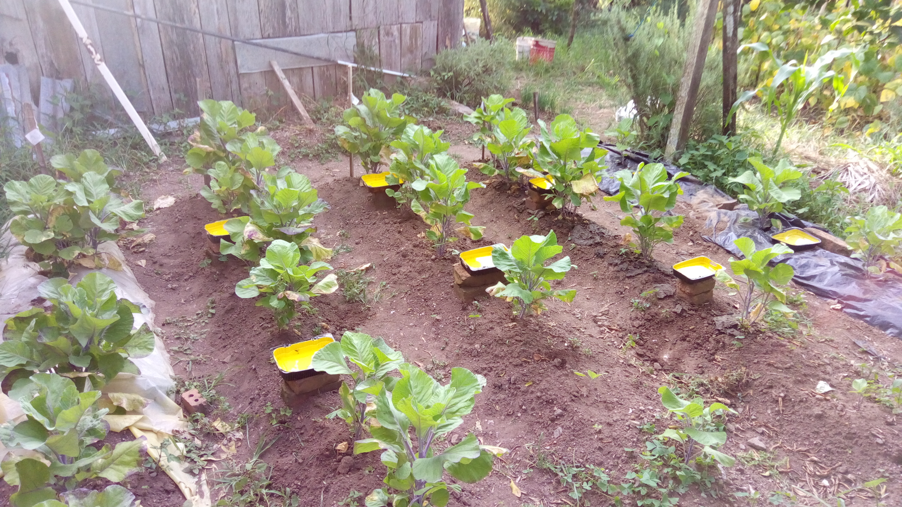

```{r setup, include=FALSE}
knitr::opts_chunk$set(echo = FALSE)
```

```{r include=FALSE}
# Leitura de dados
```

# Introdução

- Contexto


## Ciência

- Como funciona o processo científico

Método é o conjunto das atividades sistemáticas e racionais que, com maior segurança e economia, permite alcançar o objetivo de produzir conhecimentos válidos e verdadeiros, traçando o caminho a ser seguido, detectando erros e auxiliando as decisões do cientista. (fundamentos do método científico 9 edição)

Trabalho científico é uma expressão genérica para gêneros acadêmico-cientí-ficos, como: artigo científico, comunicação científica, dissertação de mestrado, ensaio científico, fichamento, informe científico, inventário acadêmico, mapa conceitual, memorial, monografia, paper, plano de pesquisa, pôster, pré-projeto de pesquisa, projeto de pesquisa, relatório, resenha, resumo, tese de doutorado, trabalho de conclusão de grupo (cf. BRASILEIRO, 2013, p. 69-167). 

Os trabalhos científicos devem ser elaborados de acordo com normas preestabelecidas e com os fins a que se destinam, bem como ser inéditos ou originais e contribuir não só para a ampliação de conhecimentos, ou a compreensão de certos problemas, mas também servir de modelo ou oferecer subsídios para outros trabalhos.

Para Salvador (1980, p. 11), os trabalhos científicos originais devem permitir a outro pesquisador, baseado nas informações dadas:

(a) Reproduzir as experiências e obter os resultados descritos, com a mesma precisão e sem ultrapassar a margem de erro indicada pelo autor.
(b) Repetir as observações e julgar as conclusões do autor.
(c) Verificar a exatidão das análises e deduções que permitiram ao autor chegar às conclusões.


---

- Os elementos de base do método científico
- (figura)

## Reprodutibilidade 

- É um pilar da ciência
- Experimental
- *Análise*

# Estudo de caso: Biomulching

- Para aplicar o conceito de reprodutibilidade utilizamos como estudo de caso o Biomulching.
- O Biomulching foi um projeto desenvolvido no ensino médio o qual tinha como objetivo desenvolver um novo método de prevenção e controle de pragas na agricultura, mais especificamente as pragas de couves.

Ele consiste de um bioplástico produzido a base de casca de laranja com a agregação de essência de pimenta...


## Motivação

Avaliar os dados obtidos anteriormente com a utiliação de ferramentas computacionais como o RStudio com o objetivo de melhorar a reprodutibilidade da análise dos dados.


## Como havia sido feito o experimento em si

- Obtenção dos dados
- Variáveis analisadas




## Como havia sido feito a *análise*
  - Capturas de tela com Excel, com as tabelas


  - Todo o processo de análise/interpretação dos resultados foi feito por ali

## Visão crítica da *análise do estudo de biomulching*

- Baseado na premissa que Excel tem problemas
- A ideia é usar uma método de análise mais reprodutível, empregando

## Programação Literal

- o que é e como foi empregado no trabalho
- exemplo


## Ferramentas modernas de análise de dados (baseadas na linguagem R)

- Quais são e quais foram utilizadas no trabalho
- Tidyverse


## Métodos e Materias

---


# Objetivos

## Objetivos

- Principais questionamentos:

  - O _Biomulching_ pode ser usado como cobertura de solo?
  
  - O _Biomulching_ auxilia no controle de pragas?

# Resultados


## Biomulching como cobertura de solo

- funciona


## Biomulching no controle de pragas

- não funciona


# Discussão


## Visão crítica da aplicação do método usando prog. literal e ferramentas modernas


## Visão crítica de quão possível foi reproduzir as conclusões da análise anterior


## Conclusão

- Todo esse trabalho está disponível no meu github, link
  - Comentários e sugestões são bem-vindos
- Relatório de pesquisa reprodutível focado no biomulching
  - Link
- Link para o teu site