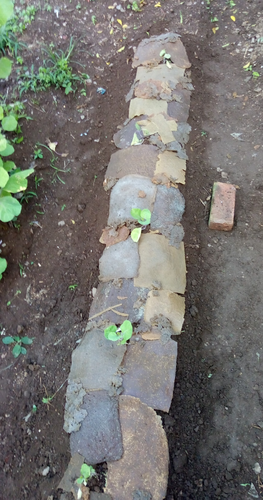

```{r setup, include=FALSE}
knitr::opts_chunk$set(echo = FALSE)
```

```{r include=FALSE}
# Leitura de dados
```

# Introdução

- Contexto


## Ciência 

- Como funciona o processo científico

---

- Os elementos de base do método científico
- (figura)

## Reprodutibilidade 

- É um pilar da ciência
- Experimental
- *Análise*

# Estudo de caso: Biomulching



## Motivação


## Como havia sido feito o experimento em si


## Como havia sido feito a *análise*
  - Capturas de tela com Excel, com as tabelas
  - Todo o processo de análise/interpretação dos resultados foi feito por ali

## Visão crítica da *análise do estudo de biomulching*

- Baseado na premissa que Excel tem problemas
- A ideia é usar uma método de análise mais reprodutível, empregando

## Programação Literal

- o que é e como foi empregado no trabalho
- exemplo


## Ferramentas modernas de análise de dados (baseadas na linguagem R)

- Quais são e quais foram utilizadas no trabalho
- Tidyverse


## Métodos e Materias

---


# Objetivos

## Objetivos

- Principais questionamentos:

  - O _Biomulching_ pode ser usado como cobertura de solo?
  
  - O _Biomulching_ auxilia no controle de pragas?

# Resultados


## Biomulching como cobertura de solo

- funciona


## Biomulching no controle de pragas

- não funciona


# Discussão


## Visão crítica da aplicação do método usando prog. literal e ferramentas modernas


## Visão crítica de quão possível foi reproduzir as conclusões da análise anterior


## Conclusão

- Todo esse trabalho está disponível no meu github, link
  - Comentários e sugestões são bem-vindos
- Relatório de pesquisa reprodutível focado no biomulching
  - Link
- Link para o teu site